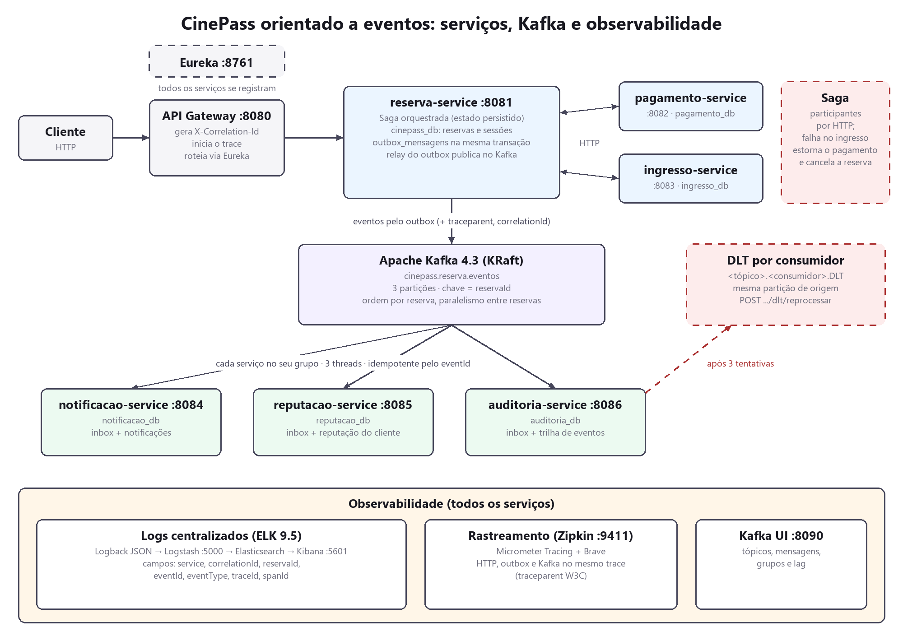
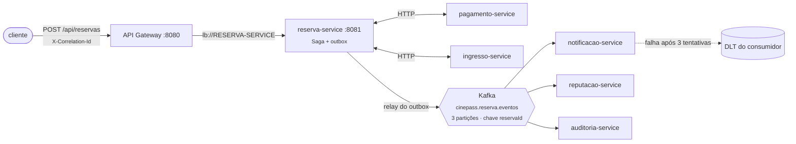
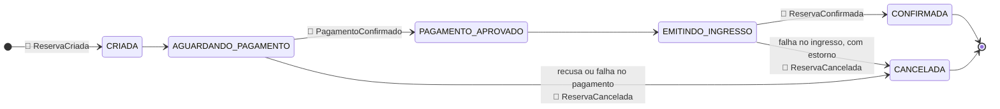
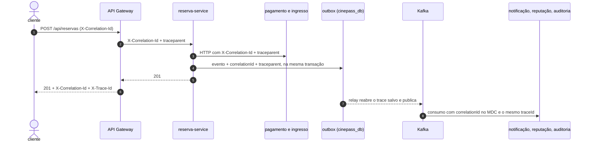
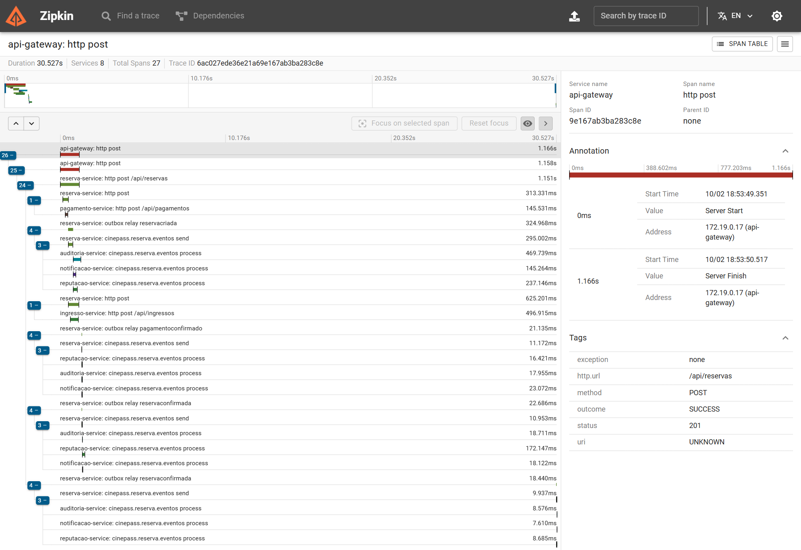
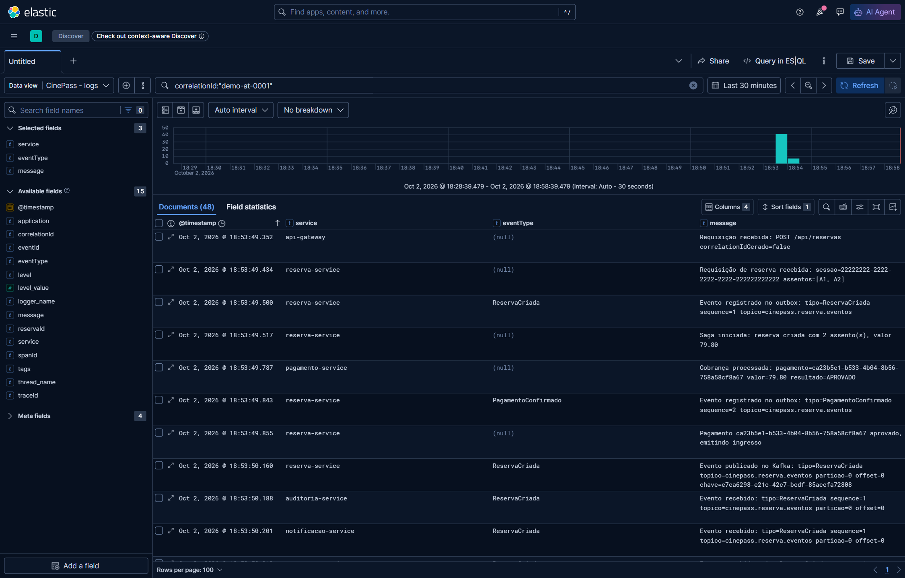

<div align="center">


# 🎬 CinePass orientado a eventos

**O ciclo de vida da reserva publicado no Kafka, consumido sem chamada HTTP, com ordem por reserva, efeito único e a operação inteira visível num trace e numa busca de log**

<sub>DR4-AT · Bloco Engenharia de Softwares Escaláveis · Trabalho individual</sub>

<br/>

[](#-stack)
[](#-stack)
[](#-stack)
[](#-t%C3%B3picos-e-eventos)
[](#-stack)
[](#-observabilidade)
[](#-observabilidade)
[](#%EF%B8%8F-como-rodar)
[](LICENSE)

[](#%EF%B8%8F-confiabilidade)
[](#%EF%B8%8F-confiabilidade)
[](#%EF%B8%8F-confiabilidade)
[](#%EF%B8%8F-arquitetura)
[](docs/asyncapi.yaml)
[](#%EF%B8%8F-como-rodar)

<br/>

[](docs/RELATORIO_AT.md)
[](docs/RELATORIO_AT.md#13--evid%C3%AAncias-da-execu%C3%A7%C3%A3o)

</div>

---

## 🧭 Índice

| | Seção | O que você encontra |
|:---:|---|---|
| 💡 | [Visão geral](#-vis%C3%A3o-geral) | a base do professor, o que mudou e a tradução do enunciado |
| 🏗️ | [Arquitetura](#%EF%B8%8F-arquitetura) | diagrama, a decisão central e a Saga no lugar do Temporal |
| 🧱 | [Serviços e estrutura](#-servi%C3%A7os-e-estrutura) | os oito serviços, portas, bancos e pastas |
| 📨 | [Tópicos e eventos](#-t%C3%B3picos-e-eventos) | tópicos, os quatro eventos e o ciclo de vida da reserva |
| 🛡️ | [Confiabilidade](#%EF%B8%8F-confiabilidade) | outbox, ordem, idempotência, DLT e concorrência |
| 🔭 | [Observabilidade](#-observabilidade) | correlationId, ELK, Zipkin e o caminho de uma operação |
| ▶️ | [Como rodar](#%EF%B8%8F-como-rodar) | Docker Compose, painéis, testes e exemplos de chamadas |
| 📸 | [Evidências](#-evid%C3%AAncias) | destaques e a lista das 19 capturas |
| 📄 | [Documentação](#-documenta%C3%A7%C3%A3o) | relatório, especificação dos eventos, AsyncAPI, enunciado e rúbrica |
| 📚 | [Stack](#-stack) | tecnologias e versões |

---

## 💡 Visão geral

A base é o [**CinePass**](https://github.com/leoinfnet/cinepass) do professor: reserva, pagamento e
ingresso atrás de um API Gateway, com Eureka e um banco PostgreSQL por serviço. Este trabalho
evolui a comunicação para um modelo orientado a eventos:

- 📤 o `reserva-service` publica cada fato relevante do ciclo de vida da reserva no **Kafka**, pelo
  padrão **Transactional Outbox**;
- 📥 três serviços novos, **notificação**, **reputação** e **auditoria**, reagem a esses eventos sem
  que o `reserva-service` saiba que eles existem;
- 🔀 reservas diferentes são processadas **em paralelo**, e os eventos de uma mesma reserva, **em
  ordem**;
- 🔁 uma mensagem repetida **não produz efeito duplicado**, e uma mensagem que não pode ser processada
  vai para uma **DLT**, de onde pode ser reprocessada;
- 🧵 toda operação tem um **correlationId** nascido no Gateway e um **trace** no Zipkin que atravessa
  HTTP, banco e Kafka; os logs de todos os serviços estão num só lugar, no **Kibana**.

> [!NOTE]
> O enunciado original falava de um *Freela Marketplace*; a tradução para o CinePass está em
> [`docs/context/enunciado-DR4-AT.md`](docs/context/enunciado-DR4-AT.md): o `contrato-service` é o
> `reserva-service`, e o `contratoId` é o `reservaId`.

> **Disciplina:** Domain-Driven Design (DDD) e Arquitetura de Softwares Escaláveis com Java  
> **Professor:** Leonardo Silva da Gloria  
> **Aluno:** André Luis Becker  
> **Trabalho:** Assessment (AT), individual  
> **Trimestre:** 26E3  

---

## 🏗️ Arquitetura





> [!IMPORTANT]
> **A decisão central:** o `reserva-service` não chama nenhum serviço auxiliar. Ele grava o evento
> na mesma transação que muda a reserva, e o relay do outbox o publica. Quem se interessa, consome.
> Pagamento e ingresso continuam por HTTP porque são **participantes da Saga**: a reserva precisa da
> resposta deles para decidir o passo seguinte.

> [!NOTE]
> **Sobre o Temporal da base.** A versão do professor orquestrava a reserva com Temporal. Ele foi
> substituído por uma Saga orquestrada com estado persistido (`SagaDeReserva`), com os mesmos
> passos e compensações (estorno do pagamento e cancelamento da reserva), porque a infraestrutura
> do enunciado não inclui o servidor Temporal e porque cada passo precisa gravar o evento no outbox
> dentro da própria transação.

---

## 🧱 Serviços e estrutura

| Serviço | Porta | Banco | Papel |
|---|:---:|---|---|
| 🧭 `discovery-server` | 8761 | | Eureka Server |
| 🚪 `api-gateway` | 8080 | | Porta de entrada; gera o `X-Correlation-Id` e inicia o trace |
| 🎟️ `reserva-service` | 8081 | `cinepass_db` | Ciclo de vida da reserva; Saga; **produtor** dos eventos (outbox) |
| 💳 `pagamento-service` | 8082 | `pagamento_db` | Cobrança e estorno (participante da Saga) |
| 🎫 `ingresso-service` | 8083 | `ingresso_db` | Emissão de ingresso (participante da Saga) |
| ✉️ `notificacao-service` | 8084 | `notificacao_db` | **Consumidor**: registra a notificação de cada fato da reserva |
| ⭐ `reputacao-service` | 8085 | `reputacao_db` | **Consumidor**: reputação e histórico do cliente |
| 🗃️ `auditoria-service` | 8086 | `auditoria_db` | **Consumidor**: trilha de todos os eventos, consultável |

```text
cinepass-mensageria/    biblioteca técnica: envelope, outbox + relay, inbox, DLT, correlação, logs
discovery-server/       Eureka
api-gateway/            Spring Cloud Gateway (WebFlux) + filtro de correlação
reserva-service/        domínio Reserva/Sessão, Saga, eventos de domínio, outbox
pagamento-service/      domínio Pagamento (base do professor)
ingresso-service/       domínio Ingresso (base do professor)
notificacao-service/    consumidor de notificações
reputacao-service/      consumidor de reputação
auditoria-service/      consumidor de auditoria
infra/                  init do PostgreSQL, pipeline do Logstash, setup do Kibana
docs/                   especificação dos eventos, AsyncAPI, relatório, evidências
requests/ · bruno/      exemplos de chamadas
Dockerfile              um Dockerfile para os oito serviços (ARG MODULO)
docker-compose.yml      infraestrutura, observabilidade e serviços
```

> [!TIP]
> Os serviços não compartilham classes de domínio. O único módulo comum, `cinepass-mensageria`, é
> técnico e liga cada mecanismo por autoconfiguração: o outbox só no serviço que o habilita, a inbox
> só nos que se declaram consumidores.

---

## 📨 Tópicos e eventos

| Tópico | Partições | Chave | Produtor | Consumidores |
|---|:---:|---|---|---|
| `cinepass.reserva.eventos` | 3 | `reservaId` | reserva-service | notificação, reputação, auditoria |
| `cinepass.reserva.eventos.<consumidor>.DLT` | 3 | `reservaId` | o próprio consumidor | reprocessador do consumidor |

| Evento | Quando | Efeito nos consumidores |
|---|---|---|
| 🆕 `ReservaCriada` | assentos bloqueados, aguardando pagamento | notificação, auditoria |
| 💳 `PagamentoConfirmado` | pagamento aprovado | notificação, auditoria |
| ✅ `ReservaConfirmada` | ingresso emitido | notificação, **reputação** (+pontos), auditoria |
| ❌ `ReservaCancelada` | recusa ou compensação | notificação, **reputação** (penalidade só se recusa), auditoria |

### 🔄 Ciclo de vida da reserva

Cada transição relevante do agregado `Reserva` registra um evento de domínio, que vira uma linha do
outbox na mesma transação:



Todo evento viaja no mesmo envelope: `eventId`, `eventType`, `eventVersion`, `reservaId`,
`sequence`, `occurredAt`, `correlationId`, `producer` e `payload`. Os cabeçalhos Kafka repetem
`eventId`, `eventType`, `reservaId` e `correlationId`, e levam o `traceparent`.

> [!TIP]
> 📄 **Especificação completa, com exemplos reais:** [`docs/EVENTOS.md`](docs/EVENTOS.md) ·
> AsyncAPI 3.1 validado: [`docs/asyncapi.yaml`](docs/asyncapi.yaml)

---

## 🛡️ Confiabilidade

| Problema | Solução | Onde |
|---|---|---|
| 💾 Gravar no banco e publicar no Kafka sem transação distribuída | **Transactional Outbox**: o evento é uma linha na mesma transação; um relay publica depois, em ordem, e só marca após o ack | `PublicadorOutbox`, `RelayOutbox` |
| 🔢 Ordem dos eventos da mesma reserva | Um tópico, chave = `reservaId`, uma thread por partição (`concurrency: 3`), produtor idempotente | `application.yml`, `Topicos` |
| 🔀 Paralelismo entre reservas | 3 partições, 3 threads por grupo consumidor | `OrdenacaoEConcorrenciaTest` |
| 🔁 Mensagem repetida | **Consumidor idempotente**: `eventId` na inbox e efeito no mesmo commit; restrição única nas tabelas de efeito | `ConsumidorIdempotente` |
| 🚨 Falha no consumo | 3 tentativas (1 s, 2 s) e **DLT por consumidor** na mesma partição; o consumo segue | `InboxAutoConfiguration` |
| ♻️ Reprocessar depois da correção | `POST /api/<serviço>/dlt/reprocessar`, pelo mesmo caminho idempotente | `ReprocessadorDeDlt` |
| 🔒 Atualização concorrente da reputação de um cliente | `insert ... on conflict do nothing` + `select ... for update` | `ReputacaoRepositoryJpaAdapter` |
| 🎟️ Reservas simultâneas na mesma sessão | `select ... for update` na sessão, transação curta | `SessaoRepository.buscarPorIdParaAtualizar` |

---

## 🔭 Observabilidade

| Necessidade | Solução |
|---|---|
| 🧵 Correlação | O Gateway gera ou valida o `X-Correlation-Id`, que segue no HTTP, no envelope e no cabeçalho Kafka, e entra no MDC de todos os serviços |
| 🗂️ Logs centralizados | Logback com `LogstashTcpSocketAppender` (JSON) → **Logstash** → **Elasticsearch** → **Kibana** (data view `cinepass-logs-*` criada na subida) |
| 🏷️ Campos de log | `service`, `correlationId`, `reservaId`, `eventId`, `eventType`, `traceId`, `spanId`, `thread_name`, `level`, `message` |
| 🙈 Dados sensíveis | e-mail sai mascarado (`m***@example.com`); o encoder ainda mascara e-mail, cartão e campos de senha por padrão |
| 🛰️ Rastreamento | **Micrometer Tracing + Brave → Zipkin** (substituto oficial do Spring Cloud Sleuth); observação ligada no `KafkaTemplate` e nos listeners; o `traceparent` é salvo no outbox para o trace atravessar a tabela |



Uma operação inteira, do Gateway aos três consumidores, aparece num único trace no Zipkin e numa
única busca `correlationId:"..."` no Kibana. Ver as [evidências](#-evid%C3%AAncias).

> [!NOTE]
> A rúbrica cita o **Spring Cloud Sleuth**, descontinuado desde o Spring Boot 3. O mesmo papel é do
> **Micrometer Tracing** com a ponte para o Brave, a biblioteca que o próprio Sleuth usava.

---

## ▶️ Como rodar

> [!WARNING]
> **Pré-requisitos:** Docker Desktop (16 GB de memória para o Docker é confortável) e, para os
> testes, Java 25 e Maven 3.9.

**Tudo pelo Docker Compose** (o build dos oito serviços acontece dentro do Docker):

```bash
docker compose up -d --build
```

> [!TIP]
> Na primeira vez leva alguns minutos. Os serviços estão prontos quando o Eureka lista os sete
> clientes e `GET http://localhost:8080/api/sessoes` responde 200.

| Painel | URL |
|---|---|
| 🚪 API Gateway | http://localhost:8080 |
| 🧭 Eureka | http://localhost:8761 |
| 📊 Kafka UI | http://localhost:8090 |
| 🔎 Kibana (logs) | http://localhost:5601 → Discover → data view *CinePass - logs* |
| 🛰️ Zipkin (traces) | http://localhost:9411 |

<details>
<summary><b>🧑‍💻 Só a infraestrutura, para rodar os serviços pela IDE</b></summary>

<br/>

```bash
docker compose up -d postgres kafka kafka-ui zipkin elasticsearch logstash kibana kibana-setup discovery-server
```

</details>

**Os testes** sobem PostgreSQL e Kafka reais por Testcontainers e não dependem do compose:

```bash
mvn -B install
```

São **30 testes**: domínio, Saga ponta a ponta, outbox transacional, idempotência, ordem sob
concorrência, DLT com reprocessamento e concorrência na mesma sessão.

> [!CAUTION]
> **Para zerar tudo** (bancos, tópicos e índices). O `-v` apaga os volumes:
>
> ```bash
> docker compose down -v
> ```

### 🧪 Exemplos de chamadas

[`requests/cinepass.http`](requests/cinepass.http) traz os cenários prontos para o IntelliJ ou o
VS Code, e a coleção [`bruno/`](bruno) os mesmos para o Bruno. O essencial:

```bash
curl -i -X POST http://localhost:8080/api/reservas \
  -H "Content-Type: application/json" -H "X-Correlation-Id: exemplo-0001" \
  -d '{"clienteId":"33333333-3333-3333-3333-333333333333","sessaoId":"22222222-2222-2222-2222-222222222222","assentos":["A1","A2"],"simularRecusaPagamento":false,"simularFalhaIngresso":false}'
```

| Cenário | Como provocar |
|---|---|
| ✅ Caminho feliz | `simularRecusaPagamento` e `simularFalhaIngresso` em `false` |
| ❌ Pagamento recusado | `simularRecusaPagamento: true` |
| ↩️ Compensação (estorno) | `simularFalhaIngresso: true` |
| 🚨 Falha de consumo e DLT | cliente `44444444-4444-4444-4444-444444444444` (sem contato para notificação) |
| 🔁 Mensagem duplicada | `POST /api/reservas/eventos/{eventId}/republicar` |
| ♻️ Reprocessar a DLT | `PUT /api/notificacoes/destinatarios/{clienteId}` e `POST /api/notificacoes/dlt/reprocessar` |

---

## 📸 Evidências

As 19 capturas estão em [`docs/evidencias/`](docs/evidencias), todas de uma única execução do
ambiente zerado, e são comentadas uma a uma no [relatório](docs/RELATORIO_AT.md).

| | |
|---|---|
|  |  |
| 🛰️ Um trace, 27 spans, os sete serviços da operação | 🔎 Uma busca, 48 linhas de log de sete serviços, o mesmo `correlationId` |

<details>
<summary><b>📂 As 19 evidências, com o item do enunciado que cada uma comprova</b></summary>

<br/>

| Nº | Evidência | Item |
|:---:|---|:---:|
| 01 | [Containers do Docker Compose de pé](docs/evidencias/01-docker-compose-ps.png) | 11 |
| 02 | [Os sete serviços registrados no Eureka](docs/evidencias/02-eureka.png) | 11 |
| 03 | [Requisição pelo API Gateway: 201, `X-Correlation-Id` e `X-Trace-Id`](docs/evidencias/03-gateway-requisicao.png) | 9, 13 |
| 04 | [Reserva e outbox gravados na mesma transação](docs/evidencias/04-reserva-persistida-outbox.png) | 9, 13 |
| 05 | [Tópico no Kafka UI, eventos da reserva na mesma partição](docs/evidencias/05-kafka-topico.png) | 1, 4 |
| 06 | [Envelope do evento `ReservaConfirmada`](docs/evidencias/06-kafka-envelope.png) | 1, 3, 5 |
| 07 | [Cabeçalhos Kafka com `correlationId` e `traceparent`](docs/evidencias/07-kafka-cabecalhos.png) | 8, 9 |
| 08 | [Os três grupos consumidores, lag zero](docs/evidencias/08-kafka-consumidores.png) | 2 |
| 09 | [Efeitos persistidos nos bancos dos consumidores](docs/evidencias/09-persistencia-consumidores.png) | 2, 9 |
| 10 | [Mensagem duplicada ignorada pelos três consumidores](docs/evidencias/10-mensagem-duplicada.png) | 5 |
| 11 | [Seis reservas paralelas, ordem preservada por reserva](docs/evidencias/11-ordem-concorrencia.png) | 4 |
| 12 | [Kibana: threads de consumo intercaladas](docs/evidencias/12-kibana-threads.png) | 4, 7 |
| 13 | [Kibana: 48 linhas de log para um `correlationId`](docs/evidencias/13-kibana-correlacao.png) | 7, 9 |
| 14 | [Zipkin: um trace com 27 spans](docs/evidencias/14-zipkin-trace.png) | 8 |
| 15 | [Compensação da Saga: estorno e `ReservaCancelada`](docs/evidencias/15-saga-compensacao.png) | 10 |
| 16 | [Três tentativas e envio à DLT](docs/evidencias/16-dlt-falha.png) | 6, 10 |
| 17 | [DLT da notificação no Kafka UI](docs/evidencias/17-kafka-dlt.png) | 10 |
| 18 | [Reprocessamento da DLT depois da correção](docs/evidencias/18-dlt-reprocessamento.png) | 10 |
| 19 | [Suíte de testes: 30 testes verdes](docs/evidencias/19-testes.png) | todos |

</details>

---

## 📄 Documentação

| Documento | O que traz |
|---|---|
| 📑 [Relatório do AT](docs/RELATORIO_AT.md) | Os 13 itens do enunciado, decisões, evidências comentadas e limites |
| 📨 [`docs/EVENTOS.md`](docs/EVENTOS.md) | Especificação das mensagens: o contrato entre os serviços |
| 📜 [`docs/asyncapi.yaml`](docs/asyncapi.yaml) | O mesmo contrato em AsyncAPI 3.1.0 |
| 🎯 [Enunciado](docs/context/enunciado-DR4-AT.md) e [rúbrica](docs/context/rubrica-DR4-AT.md) | Fonte de verdade, com a tradução para o CinePass e o mapa critério → código |

---

## 📚 Stack

| Camada | Tecnologia |
|---|---|
| ☕ Linguagem e framework | Java 25 · Spring Boot 4.1.1 · Spring Cloud 2025.1.3 |
| 🧭 Descoberta e borda | Eureka · Spring Cloud Gateway Server WebFlux · Spring Cloud LoadBalancer |
| 📨 Mensageria | Apache Kafka 4.3.1 (KRaft) · Spring for Apache Kafka · Kafka UI (kafbat) 1.5 |
| 🐘 Persistência | PostgreSQL 18, um banco por serviço · Spring Data JPA · Hibernate 7 |
| 🗂️ Logs | Logback + logstash-logback-encoder 9 · Logstash, Elasticsearch e Kibana 9.5 |
| 🛰️ Tracing | Micrometer Tracing · Brave · Zipkin 3 |
| 📜 Especificação | AsyncAPI 3.1.0 |
| 🧪 Testes | JUnit 5 · Testcontainers 2 · Awaitility |
| 🐳 Build e execução | Maven multi-módulo · Docker (imagem única, sem root) · Docker Compose |

---

<div align="center">

<sub>Infnet · Bloco Engenharia de Softwares Escaláveis · DR4 · 26E3 · base: <a href="https://github.com/leoinfnet/cinepass">leoinfnet/cinepass</a></sub>


</div>
