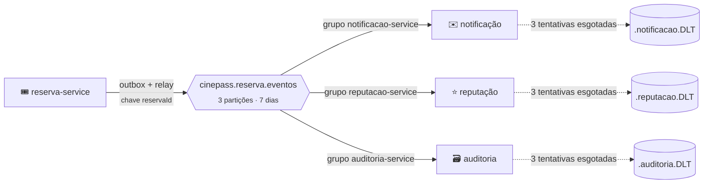

<div align="center">


# 📨 Especificação dos eventos · CinePass

[](asyncapi.yaml)
[](#2--t%C3%B3picos)
[](#5--eventos)
[](#3--chave-de-publica%C3%A7%C3%A3o-e-particionamento)
[](#6--pol%C3%ADtica-de-consumo-e-erro)

[⬅️ README](../README.md) · [📑 Relatório](RELATORIO_AT.md) · [📜 AsyncAPI](asyncapi.yaml)

</div>

Contrato de comunicação entre os microsserviços do CinePass. Todo evento de integração publicado
no Kafka segue este documento. A versão legível por máquina está em
[`asyncapi.yaml`](asyncapi.yaml) (AsyncAPI 3.1.0).

> [!NOTE]
> Os exemplos abaixo não foram escritos à mão: são as mensagens reais gravadas no outbox durante
> a execução das evidências (correlationId `demo-at-0001` e `demo-at-compensacao`).

| | Seção |
|:---:|---|
| 🧭 | [1. Visão geral](#1--vis%C3%A3o-geral) |
| 📬 | [2. Tópicos](#2--t%C3%B3picos) |
| 🔑 | [3. Chave de publicação e particionamento](#3--chave-de-publica%C3%A7%C3%A3o-e-particionamento) |
| 📦 | [4. Envelope (comum a todos os eventos)](#4--envelope-comum-a-todos-os-eventos) |
| 📨 | [5. Eventos](#5--eventos): [`ReservaCriada`](#51--reservacriada) · [`PagamentoConfirmado`](#52--pagamentoconfirmado) · [`ReservaConfirmada`](#53--reservaconfirmada) · [`ReservaCancelada`](#54--reservacancelada) |
| 🚨 | [6. Política de consumo e erro](#6--pol%C3%ADtica-de-consumo-e-erro) |

---

## 1. 🧭 Visão geral

| Item | Valor |
|---|---|
| Broker | Apache Kafka 4.3.1, modo KRaft |
| Produtor | `reserva-service` (único) |
| Consumidores | `notificacao-service`, `reputacao-service`, `auditoria-service` |
| Formato | JSON, UTF-8, serializado como texto (`StringSerializer`) |
| Publicação | Transactional Outbox: o evento é gravado na mesma transação da mudança de estado e publicado depois pelo relay |
| Garantia de entrega | pelo menos uma vez (*at-least-once*); o efeito único é garantido pela idempotência dos consumidores |



---

## 2. 📬 Tópicos

| Tópico | Partições | Chave | Produtor | Consumidores (grupo) | Retenção |
|---|:---:|---|---|---|---|
| `cinepass.reserva.eventos` | 3 | `reservaId` | reserva-service | `notificacao-service`, `reputacao-service`, `auditoria-service` | 7 dias |
| `cinepass.reserva.eventos.notificacao.DLT` | 3 | `reservaId` (preservada) | notificacao-service (recuperador) | reprocessador da notificação | padrão do broker |
| `cinepass.reserva.eventos.reputacao.DLT` | 3 | `reservaId` (preservada) | reputacao-service (recuperador) | reprocessador da reputação | padrão do broker |
| `cinepass.reserva.eventos.auditoria.DLT` | 3 | `reservaId` (preservada) | auditoria-service (recuperador) | reprocessador da auditoria | padrão do broker |

> [!IMPORTANT]
> **Um tópico só para os quatro tipos de evento.** A ordem no Kafka só existe dentro de uma
> partição. Se cada tipo tivesse seu tópico, `ReservaConfirmada` poderia ser lida antes de
> `ReservaCriada`. Com um tópico e a mesma chave, os eventos de uma reserva caem sempre na mesma
> partição, na ordem em que foram gravados.

> [!TIP]
> **Uma DLT por consumidor.** A mesma mensagem pode falhar só na notificação (cliente sem contato) e
> passar na auditoria. A DLT de cada consumidor guarda apenas as falhas dele, e o reprocessamento não
> reentrega a mensagem a quem já a processou.

Os tópicos são declarados no código (`NewTopic`): o principal em `TopicosKafkaConfig`
(reserva-service) e em `InboxAutoConfiguration` (consumidores), as DLTs em
`InboxAutoConfiguration`. Quem sobe primeiro cria; os outros encontram pronto.

---

## 3. 🔑 Chave de publicação e particionamento

| Regra | Motivo |
|---|---|
| 🔑 A chave é o `reservaId` (UUID em texto) | Todos os eventos de uma reserva vão para a mesma partição (`murmur2(chave) % 3`) e são lidos em ordem |
| 🧩 3 partições | Até 3 reservas diferentes processadas ao mesmo tempo por consumidor |
| 🧵 `concurrency: 3` em cada consumidor | Uma thread por partição: paralelismo entre reservas, sequência dentro de cada reserva |
| ✔️ `ack-mode: record` | O offset é confirmado registro a registro, depois do commit no banco do consumidor |
| 🛡️ Produtor idempotente (`enable.idempotence=true`, `acks=all`) | Reenvio por timeout não duplica nem reordena dentro da partição |
| 📤 Relay do outbox publica em ordem de gravação e para no primeiro erro | Uma linha que falhou não é ultrapassada pela seguinte da mesma reserva |

---

## 4. 📦 Envelope (comum a todos os eventos)

```json
{
  "eventId": "uuid",
  "eventType": "ReservaCriada | PagamentoConfirmado | ReservaConfirmada | ReservaCancelada",
  "eventVersion": 1,
  "reservaId": "uuid",
  "sequence": 1,
  "occurredAt": "ISO-8601 UTC",
  "correlationId": "texto",
  "producer": "reserva-service",
  "payload": { }
}
```

| Campo | Tipo | Obrigatório | Descrição |
|---|---|:---:|---|
| `eventId` | UUID | ✅ sim | Identificador único do evento. É a chave de idempotência dos consumidores |
| `eventType` | texto | ✅ sim | Tipo do evento, no passado (`ReservaCriada`...) |
| `eventVersion` | inteiro ≥ 1 | ✅ sim | Versão do contrato do payload |
| `reservaId` | UUID | ✅ sim | Reserva relacionada (o "contrato" do enunciado). Também é a chave de publicação |
| `sequence` | inteiro ≥ 1 | ✅ sim | Número do evento dentro da reserva (1, 2, 3...). Torna a ordem verificável |
| `occurredAt` | data e hora ISO-8601 (UTC) | ✅ sim | Quando o fato aconteceu no domínio |
| `correlationId` | texto (8 a 64, `[A-Za-z0-9._-]`) | ✅ sim | Identificador da operação externa que originou o evento, criado no API Gateway |
| `producer` | texto | ✅ sim | Serviço que publicou |
| `payload` | objeto | ✅ sim | Dados do evento (seção 5) |

### 🏷️ Cabeçalhos Kafka

| Cabeçalho | Conteúdo | Quem grava |
|---|---|---|
| `eventId` | igual ao envelope | relay do outbox |
| `eventType` | igual ao envelope | relay do outbox |
| `reservaId` | igual ao envelope | relay do outbox |
| `correlationId` | igual ao envelope | relay do outbox |
| `traceparent` | contexto W3C Trace Context (`00-<traceId>-<spanId>-01`) | Micrometer Tracing, no envio |

Os cabeçalhos repetem campos do envelope para que ferramentas (Kafka UI, inspeção da DLT) os leiam
sem abrir o JSON. O `traceparent` é o que liga o consumo ao trace da requisição original no Zipkin.

> [!NOTE]
> Na DLT, o Spring Kafka acrescenta `kafka_dlt-original-topic`, `kafka_dlt-original-partition`,
> `kafka_dlt-original-offset`, `kafka_dlt-exception-fqcn` e `kafka_dlt-exception-message`, usados no
> diagnóstico.

### 🔖 Versionamento

- ➕ Campo novo e opcional no payload: **não muda** `eventVersion`. Os consumidores ignoram o que não
  conhecem (leitor tolerante).
- 🔄 Remover, renomear ou mudar o significado de um campo: nova versão (`eventVersion: 2`), publicada em
  paralelo à antiga até todos os consumidores migrarem.
- ❔ Tipo de evento desconhecido: o consumidor registra no log e marca como processado, sem erro.

---

## 5. 📨 Eventos

| Evento | ✉️ Notificação | ⭐ Reputação | 🗃️ Auditoria |
|---|:---:|:---:|:---:|
| [🆕 `ReservaCriada`](#51--reservacriada) | ✅ | ➖ | ✅ |
| [💳 `PagamentoConfirmado`](#52--pagamentoconfirmado) | ✅ | ➖ | ✅ |
| [✅ `ReservaConfirmada`](#53--reservaconfirmada) | ✅ | ✅ | ✅ |
| [❌ `ReservaCancelada`](#54--reservacancelada) | ✅ | ✅ | ✅ |

### 5.1 🆕 `ReservaCriada`

Os assentos foram bloqueados na sessão e a reserva passou a existir, aguardando pagamento.

| Item | Valor |
|---|---|
| Tópico | `cinepass.reserva.eventos` |
| Produtor | reserva-service, passo 1 da Saga (`ReservaApplicationService.iniciar`) |
| Consumidores | notificação (registra "Recebemos sua reserva"), auditoria (registra). Reputação: sem impacto |
| Chave | `reservaId` |

| Campo do payload | Tipo | Obrigatório |
|---|---|:---:|
| `clienteId` | UUID | ✅ sim |
| `sessaoId` | UUID | ✅ sim |
| `assentos` | lista de texto | ✅ sim |
| `valorTotal` | decimal | ✅ sim |

```json
{
  "eventId": "dc5621eb-5a51-4bb8-9cf3-7708b1298a2e",
  "eventType": "ReservaCriada",
  "eventVersion": 1,
  "reservaId": "e7ea6298-e21c-42c7-bedf-85acefa72808",
  "sequence": 1,
  "occurredAt": "2026-10-02T21:53:49.459024590Z",
  "correlationId": "demo-at-0001",
  "producer": "reserva-service",
  "payload": {
    "clienteId": "33333333-3333-3333-3333-333333333333",
    "sessaoId": "22222222-2222-2222-2222-222222222222",
    "assentos": ["A1", "A2"],
    "valorTotal": 79.8
  }
}
```

### 5.2 💳 `PagamentoConfirmado`

O pagamento da reserva foi aprovado pelo pagamento-service; a emissão do ingresso é o próximo passo.

| Item | Valor |
|---|---|
| Tópico | `cinepass.reserva.eventos` |
| Produtor | reserva-service, passo 2 da Saga (`confirmarPagamento`) |
| Consumidores | notificação ("Pagamento aprovado"), auditoria. Reputação: sem impacto |
| Chave | `reservaId` |

| Campo do payload | Tipo | Obrigatório |
|---|---|:---:|
| `clienteId` | UUID | ✅ sim |
| `pagamentoId` | UUID | ✅ sim |
| `valor` | decimal | ✅ sim |

```json
{
  "eventId": "5d58aba5-e390-4cab-9ba8-155532d3ff77",
  "eventType": "PagamentoConfirmado",
  "eventVersion": 1,
  "reservaId": "e7ea6298-e21c-42c7-bedf-85acefa72808",
  "sequence": 2,
  "occurredAt": "2026-10-02T21:53:49.838348256Z",
  "correlationId": "demo-at-0001",
  "producer": "reserva-service",
  "payload": {
    "clienteId": "33333333-3333-3333-3333-333333333333",
    "pagamentoId": "ca23b5e1-b533-4b04-8b56-758a58cf8a67",
    "valor": 79.8
  }
}
```

### 5.3 ✅ `ReservaConfirmada`

Pagamento aprovado e ingresso emitido: a reserva está concluída.

| Item | Valor |
|---|---|
| Tópico | `cinepass.reserva.eventos` |
| Produtor | reserva-service, passo 3 da Saga (`confirmar`) |
| Consumidores | notificação ("Ingresso emitido"), **reputação** (+1 confirmada, +1 ponto por real), auditoria |
| Chave | `reservaId` |

| Campo do payload | Tipo | Obrigatório |
|---|---|:---:|
| `clienteId` | UUID | ✅ sim |
| `sessaoId` | UUID | ✅ sim |
| `assentos` | lista de texto | ✅ sim |
| `valorTotal` | decimal | ✅ sim |
| `pagamentoId` | UUID | ✅ sim |
| `ingressoId` | UUID | ✅ sim |

```json
{
  "eventId": "95e27840-38d9-49d7-9de3-41df45a0fc1c",
  "eventType": "ReservaConfirmada",
  "eventVersion": 1,
  "reservaId": "e7ea6298-e21c-42c7-bedf-85acefa72808",
  "sequence": 3,
  "occurredAt": "2026-10-02T21:53:50.487149017Z",
  "correlationId": "demo-at-0001",
  "producer": "reserva-service",
  "payload": {
    "clienteId": "33333333-3333-3333-3333-333333333333",
    "sessaoId": "22222222-2222-2222-2222-222222222222",
    "assentos": ["A1", "A2"],
    "valorTotal": 79.8,
    "pagamentoId": "ca23b5e1-b533-4b04-8b56-758a58cf8a67",
    "ingressoId": "9d5a42bf-58b9-448e-8f14-941e8c559795"
  }
}
```

### 5.4 ❌ `ReservaCancelada`

A reserva foi encerrada sem conclusão e os assentos voltaram para a sessão. Quando havia pagamento
aprovado, ele foi estornado (compensação da Saga).

| Item | Valor |
|---|---|
| Tópico | `cinepass.reserva.eventos` |
| Produtor | reserva-service, compensação da Saga (`cancelar`) |
| Consumidores | notificação ("Reserva cancelada"), **reputação** (+1 cancelada; +1 recusa só se o motivo for `PAGAMENTO_RECUSADO`), auditoria |
| Chave | `reservaId` |

| Campo do payload | Tipo | Obrigatório |
|---|---|:---:|
| `clienteId` | UUID | ✅ sim |
| `motivo` | `PAGAMENTO_RECUSADO`, `FALHA_COMUNICACAO_PAGAMENTO` ou `FALHA_EMISSAO_INGRESSO` | ✅ sim |
| `valorTotal` | decimal | ✅ sim |
| `pagamentoId` | UUID | ⬜ não (ausente quando o pagamento nem respondeu) |
| `pagamentoEstornado` | booleano | ✅ sim |

```json
{
  "eventId": "45badeb4-e288-4f4f-8048-c61857f7edd0",
  "eventType": "ReservaCancelada",
  "eventVersion": 1,
  "reservaId": "a488d715-d830-4564-b3f2-97c703064aa8",
  "sequence": 3,
  "occurredAt": "2026-10-02T21:54:50.122019744Z",
  "correlationId": "demo-at-compensacao",
  "producer": "reserva-service",
  "payload": {
    "clienteId": "33333333-3333-3333-3333-333333333333",
    "motivo": "FALHA_EMISSAO_INGRESSO",
    "valorTotal": 39.9,
    "pagamentoId": "c216b58a-6d93-47b8-b9d2-89e41283a14d",
    "pagamentoEstornado": true
  }
}
```

### 🔢 Sequências possíveis de uma reserva

```text
caminho feliz          1 ReservaCriada  >  2 PagamentoConfirmado  >  3 ReservaConfirmada
pagamento recusado     1 ReservaCriada  >  2 ReservaCancelada (PAGAMENTO_RECUSADO)
falha no ingresso      1 ReservaCriada  >  2 PagamentoConfirmado  >  3 ReservaCancelada (FALHA_EMISSAO_INGRESSO, estornado)
pagamento fora do ar   1 ReservaCriada  >  2 ReservaCancelada (FALHA_COMUNICACAO_PAGAMENTO)
```

---

## 6. 🚨 Política de consumo e erro

| Situação | Comportamento |
|---|---|
| 🆕 Evento novo | Registra o `eventId` na inbox e aplica o efeito, na mesma transação |
| 🔁 Evento já processado (mesmo `eventId`) | Não aplica nada; log `WARN "Evento duplicado ignorado"` |
| ⚠️ Falha no efeito | Rollback de inbox e efeito; nova tentativa no lugar após 1 s e 2 s (3 tentativas) |
| 🚨 Tentativas esgotadas | Mensagem enviada à DLT do consumidor, na mesma partição; o consumo da partição continua |
| 🧨 Mensagem ilegível (não é envelope) | Direto para a DLT, sem tentativas |
| ♻️ Reprocessamento | `POST /api/<servico>/dlt/reprocessar` lê a DLT em ordem pelo mesmo caminho idempotente e para no primeiro erro |

---

<div align="center">

[⬆️ Topo](#-especifica%C3%A7%C3%A3o-dos-eventos--cinepass) · [⬅️ README](../README.md) · [📑 Relatório](RELATORIO_AT.md) · [📜 AsyncAPI](asyncapi.yaml)


</div>
