<!-- apenas-github -->
<div align="center">


# 📑 CinePass orientado a eventos · DR4-AT

**Os 13 itens do enunciado, cada um com a solução adotada, o código que a implementa e as evidências da execução**

[](#-sum%C3%A1rio)
[](#-testes-automatizados)
[](#13--evid%C3%AAncias-da-execu%C3%A7%C3%A3o)
[](#8--rastreamento-distribu%C3%ADdo)

[⬅️ README](../README.md) · [📨 Eventos](EVENTOS.md) · [📜 AsyncAPI](asyncapi.yaml) · [🎯 Enunciado](context/enunciado-DR4-AT.md) · [📋 Rúbrica](context/rubrica-DR4-AT.md)

</div>

> **Disciplina:** Domain-Driven Design (DDD) e Arquitetura de Softwares Escaláveis com Java  
> **Professor:** Leonardo Silva da Gloria  
> **Aluno:** André Luis Becker  
> **Turma:** DR4  
> **Trimestre:** 26E3  
> **Trabalho:** Assessment (AT), individual

## 🧭 Sumário

| | Item | Pontos-chave | Evidências |
|:---:|---|---|:---:|
| 🎯 | [Nota de escopo](#-nota-de-escopo) | tradução para o CinePass, Temporal substituído, versões | Diagrama 1 |
| 1 | [📨 Comunicação baseada em eventos](#1--comunica%C3%A7%C3%A3o-baseada-em-eventos) | eventos de domínio, envelope, tópicos | 5, 6, 7 |
| 2 | [🔗 Integração dos serviços](#2--integra%C3%A7%C3%A3o-dos-servi%C3%A7os) | três consumidores, um grupo cada | 8, 9 |
| 3 | [📜 Especificação das mensagens](#3--especifica%C3%A7%C3%A3o-das-mensagens) | `EVENTOS.md`, AsyncAPI 3.1, versionamento | 6 |
| 4 | [🔀 Processamento concorrente e ordenação](#4--processamento-concorrente-e-ordena%C3%A7%C3%A3o) | chave `reservaId`, 3 partições, uma thread por partição | 11, 12 |
| 5 | [🔁 Tratamento de mensagens duplicadas](#5--tratamento-de-mensagens-duplicadas) | inbox e efeito na mesma transação | 6, 10 |
| 6 | [📝 Logs da aplicação](#6--logs-da-aplica%C3%A7%C3%A3o) | MDC, logback comum, mascaramento | 16 |
| 7 | [🔎 Centralização de logs](#7--centraliza%C3%A7%C3%A3o-de-logs) | ELK 9.5, busca por `correlationId` | 12, 13 |
| 8 | [🔭 Rastreamento distribuído](#8--rastreamento-distribu%C3%ADdo) | Micrometer + Brave + Zipkin, `traceparent` no outbox | 7, 14 |
| 9 | [🧵 Correlação das operações](#9--correla%C3%A7%C3%A3o-das-opera%C3%A7%C3%B5es) | `X-Correlation-Id` do Gateway aos consumidores | 3, 4, 7, 9, 13 |
| 10 | [🚨 Tratamento de falhas](#10--tratamento-de-falhas) | retentativa, DLT por consumidor, reprocessamento, compensação | 15 a 18 |
| 11 | [🐳 Infraestrutura](#11--infraestrutura) | Eureka, Gateway, Kafka KRaft, bancos separados | 1, 2 |
| 12 | [📘 Documentação da solução](#12--documenta%C3%A7%C3%A3o-da-solu%C3%A7%C3%A3o) | mapa exigência → documento, Transactional Outbox | Diagrama 2 |
| 13 | [📸 Evidências da execução](#13--evid%C3%AAncias-da-execu%C3%A7%C3%A3o) | uma execução, ambiente zerado | 1 a 19 |
| 🧪 | [Testes automatizados](#-testes-automatizados) | 30 testes, verificação por mutação | 19 |
| 🚧 | [Limites desta entrega](#-limites-desta-entrega) | o que ficou de fora, e por quê | |
| 📖 | [Referências](#-refer%C3%AAncias) | | |

<!-- /apenas-github -->

---

## 🎯 Nota de escopo

O enunciado descreve a plataforma *Freela Marketplace*, com um `contrato-service` e três serviços
auxiliares. A base indicada pelo professor para o AT é o
[CinePass](https://github.com/leoinfnet/cinepass): reserva de ingressos de cinema, com
`reserva-service`, `pagamento-service`, `ingresso-service`, Eureka e API Gateway. A tradução usada
em todo o trabalho é direta:

| Enunciado | Este trabalho |
|---|---|
| contrato-service | reserva-service |
| `contratoId` | `reservaId` |
| `ContratoCriado` → `EntregaRegistrada` → `ContratoConcluido` | `ReservaCriada` → `PagamentoConfirmado` → `ReservaConfirmada` (e `ReservaCancelada`) |
| reputação e histórico do freelancer | reputação e histórico do cliente |
| notificacao-service, reputacao-service, auditoria-service | mesmos nomes, criados neste trabalho |

> [!IMPORTANT]
> **O que a base tinha e o que mudou.** A versão mais recente do professor orquestrava a reserva com
> Temporal, e todas as integrações eram HTTP. Este trabalho mantém o domínio do professor (os
> agregados `Reserva`, `Sessao`, `Pagamento` e `Ingresso`, e as portas de saída) e troca o Temporal
> por uma Saga orquestrada com estado persistido, com os mesmos passos e as mesmas compensações. O
> motivo é técnico e não de preferência: cada passo da Saga precisa gravar o evento no outbox
> dentro da sua própria transação local, e a infraestrutura listada no item 11 do enunciado não
> inclui o servidor Temporal.

> [!NOTE]
> **Versões.** Java 25 (LTS), Spring Boot 4.1.1, Spring Cloud 2025.1.3, Kafka 4.3.1 em KRaft,
> PostgreSQL 18, Elasticsearch, Logstash e Kibana 9.5.3, Zipkin 3. A rúbrica cita o **Spring Cloud
> Sleuth**, que foi descontinuado na linha 3.1 (Spring Boot 2). No Spring Boot 3 e 4 o mesmo papel é
> do **Micrometer Tracing**, com a ponte para o Brave, que era a biblioteca usada pelo próprio Sleuth.
> É a substituição oficial, e é a que este trabalho usa.

<!-- apenas-github -->
<div align="center">


</div>

<!-- /apenas-github -->


O sistema entregue tem oito serviços, seis bancos PostgreSQL isolados no mesmo servidor, um broker
Kafka e a pilha de observabilidade, tudo num `docker-compose.yml`. São **30 testes automatizados**,
os de integração contra PostgreSQL e Kafka reais em containers. As evidências do item 13 vêm todas
de uma única execução, com o ambiente zerado antes.

<p align="right"><a href="#-sum%C3%A1rio">⬆️ Sumário</a></p>

---

## 1. 📨 Comunicação baseada em eventos

> 📋 **Enunciado:** O contrato-service deverá publicar eventos relacionados às operações relevantes
> do domínio. A estrutura das mensagens deverá possuir informações suficientes para identificar: o
> evento; o tipo do evento; o contrato relacionado; a data e hora em que o evento ocorreu; os dados
> necessários para o processamento pelos serviços consumidores; informações de correlação
> utilizadas para rastreamento da operação. Os eventos deverão ser publicados em tópicos Kafka
> definidos pela equipe. A definição dos tópicos, produtores, consumidores, chaves de
> particionamento e formato das mensagens deverá ser documentada.

### Os eventos nascem no agregado

Cada transição relevante da `Reserva` registra um **evento de domínio**: o agregado não sabe
publicar nada, só acumula os fatos. O `eventId` nasce aqui, junto com o fato, e é o mesmo que
viajará no Kafka e que os consumidores usarão para reconhecer uma reentrega.

```java
public void confirmarPagamento(UUID pagamentoId) {
    exigir(StatusReserva.AGUARDANDO_PAGAMENTO);
    this.pagamentoId = Objects.requireNonNull(pagamentoId);
    status = StatusReserva.PAGAMENTO_APROVADO;
    registrar(new PagamentoConfirmado(UUID.randomUUID(), id, clienteId,
            proximaSequencia(), Instant.now(), pagamentoId, valorTotal));
}
```

Os quatro eventos (`ReservaCriada`, `PagamentoConfirmado`, `ReservaConfirmada`,
`ReservaCancelada`) formam uma interface selada, `EventoDeReserva`, sem nenhuma anotação de
framework. A `sequencia` conta os eventos de cada reserva (1, 2, 3...) e persiste com ela.

<!-- apenas-github -->
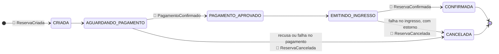
<!-- /apenas-github -->

### Do evento de domínio ao evento de integração

O serviço de aplicação entrega os eventos a uma porta, `PublicadorDeEventos`, na mesma transação
que grava o agregado. O adaptador dessa porta traduz cada evento para o contrato publicado e o
envolve no envelope:

| Exigência do enunciado | Campo do envelope |
|---|---|
| o evento | `eventId` (UUID) |
| o tipo do evento | `eventType` (e `eventVersion`) |
| o contrato relacionado | `reservaId`, que também é a chave de publicação |
| data e hora | `occurredAt` (ISO-8601, UTC) |
| dados para os consumidores | `payload`, com `clienteId` sempre presente |
| correlação | `correlationId`, mais o `traceparent` no cabeçalho Kafka |

> [!TIP]
> O payload publicado é distinto do evento de domínio de propósito. O domínio usa objetos de valor
> (`ReservaId`, `Dinheiro`); o contrato usa tipos primitivos, que qualquer consumidor lê sem
> conhecer o modelo do produtor. Assim o domínio pode mudar sem quebrar quem consome, desde que a
> tradução preserve o contrato.

### Tópicos

Um tópico principal, `cinepass.reserva.eventos`, com **3 partições** e chave `reservaId`, e uma
DLT por consumidor. Ter um tópico só para os quatro tipos é o que garante a ordem (item 4). Os
tópicos são declarados no código (`NewTopic`), e a definição completa de tópicos, produtor,
consumidores, chaves e formato está em [`docs/EVENTOS.md`](EVENTOS.md) e em
[`docs/asyncapi.yaml`](asyncapi.yaml), validado em AsyncAPI 3.1.0.

<p align="right"><a href="#-sum%C3%A1rio">⬆️ Sumário</a></p>

---

## 2. 🔗 Integração dos serviços

> 📋 **Enunciado:** Os serviços auxiliares deverão consumir as mensagens relacionadas às suas
> responsabilidades. O notificacao-service deverá receber eventos relacionados ao ciclo de vida dos
> contratos e registrar as notificações correspondentes, com logs que identifiquem o evento
> recebido, o contrato associado, o destinatário e o resultado do processamento. O
> reputacao-service deverá reagir aos eventos que possuam impacto sobre os dados de reputação ou
> histórico do freelancer, persistindo as alterações no banco de dados do próprio serviço. O
> auditoria-service deverá registrar os eventos processados pela plataforma, permitindo consultar
> posteriormente, no mínimo: identificador do evento, tipo, contrato relacionado, data e hora,
> identificador de correlação e conteúdo relevante da mensagem.

> [!IMPORTANT]
> Os três serviços consomem o mesmo tópico, **cada um no seu grupo**, e por isso cada um recebe todos
> os eventos, independentemente dos outros. O `reserva-service` não conhece nenhum deles: não há
> cliente HTTP, configuração ou dependência apontando para notificação, reputação ou auditoria.

| Serviço | Reage a | Efeito persistido (banco próprio) |
|---|---|---|
| notificacao-service | os quatro eventos | uma notificação por evento em `notificacoes` (restrição única em `event_id`), com destinatário mascarado |
| reputacao-service | `ReservaConfirmada`, `ReservaCancelada` | contadores e pontos em `reputacoes`; uma linha por evento em `historico_reputacao` |
| auditoria-service | todos, inclusive tipos que nenhum outro usa | o registro completo em `registros_auditoria`, com partição, offset e traceId |

**Notificação.** O destinatário é o cliente do evento; o contato vem do cadastro do próprio
serviço (`destinatarios`). O log de cada processamento identifica o evento e a reserva (pelas
chaves do MDC, item 6), o destinatário mascarado e o resultado:

```text
Notificação registrada: destinatario=m***@example.com cliente=33333333-... canal=EMAIL
assunto="Ingresso emitido" resultado=REGISTRADA
```

**Reputação.** No CinePass a reputação é do cliente. Reserva confirmada soma um ponto por real
gasto; pagamento recusado pesa contra o cliente; falha da plataforma (ingresso não emitido) entra
no histórico sem penalidade, porque o cliente não teve culpa. `ReservaCriada` e
`PagamentoConfirmado` são etapas intermediárias e não mudam a reputação.

**Auditoria.** A consulta atende todos os campos pedidos, com filtros combináveis:

```text
GET /api/auditoria/eventos?reservaId=...       o ciclo de vida da reserva, em ordem
GET /api/auditoria/eventos?correlationId=...   tudo o que uma operação externa gerou
GET /api/auditoria/eventos?eventType=ReservaCancelada
GET /api/auditoria/eventos/{eventId}
```

Cada registro guarda `eventId`, `eventType`, `eventVersion`, `reservaId`, `sequence`,
`occurredAt`, `correlationId`, `producer`, o `payload` inteiro e, além do pedido, o tópico, a
partição, o offset e o `traceId` do consumo, que aponta direto para o trace no Zipkin. As
evidências estão nas Evidências 8 e 9 do item 13.

<p align="right"><a href="#-sum%C3%A1rio">⬆️ Sumário</a></p>

---

## 3. 📜 Especificação das mensagens

> 📋 **Enunciado:** Deverá ser produzida uma especificação dos eventos utilizados na solução,
> apresentando, para cada mensagem: nome do evento; tópico Kafka; serviço produtor; serviços
> consumidores; estrutura do payload; campos obrigatórios; chave utilizada para publicação; exemplo
> de mensagem. A documentação deverá representar o contrato de comunicação entre os
> microsserviços.

A especificação completa está em [`docs/EVENTOS.md`](EVENTOS.md), com uma seção por evento, e em
[`docs/asyncapi.yaml`](asyncapi.yaml), no formato padrão de contratos assíncronos, validado com a
CLI oficial (*valid, no governance issues*). Os exemplos não foram escritos à mão: são as mensagens
reais gravadas no outbox durante a execução das evidências. O resumo:

| Evento | Tópico | Produtor | Consumidores | Chave | Payload (todos obrigatórios, salvo indicação) |
|---|---|---|---|---|---|
| `ReservaCriada` | `cinepass.reserva.eventos` | reserva-service | notificação, auditoria | `reservaId` | `clienteId`, `sessaoId`, `assentos`, `valorTotal` |
| `PagamentoConfirmado` | idem | reserva-service | notificação, auditoria | `reservaId` | `clienteId`, `pagamentoId`, `valor` |
| `ReservaConfirmada` | idem | reserva-service | notificação, reputação, auditoria | `reservaId` | `clienteId`, `sessaoId`, `assentos`, `valorTotal`, `pagamentoId`, `ingressoId` |
| `ReservaCancelada` | idem | reserva-service | notificação, reputação, auditoria | `reservaId` | `clienteId`, `motivo`, `valorTotal`, `pagamentoEstornado`; `pagamentoId` opcional |

O envelope comum tem nove campos obrigatórios: `eventId`, `eventType`, `eventVersion`,
`reservaId`, `sequence`, `occurredAt`, `correlationId`, `producer` e `payload`. Um exemplo real,
da reserva usada nas evidências:

```json
{
  "eventId": "95e27840-38d9-49d7-9de3-41df45a0fc1c",
  "eventType": "ReservaConfirmada",
  "eventVersion": 1,
  "reservaId": "e7ea6298-e21c-42c7-bedf-85acefa72808",
  "sequence": 3,
  "occurredAt": "2026-10-02T21:53:50.487149017Z",
  "correlationId": "demo-at-0001",
  "producer": "reserva-service",
  "payload": {
    "clienteId": "33333333-3333-3333-3333-333333333333",
    "sessaoId": "22222222-2222-2222-2222-222222222222",
    "assentos": ["A1", "A2"],
    "valorTotal": 79.8,
    "pagamentoId": "ca23b5e1-b533-4b04-8b56-758a58cf8a67",
    "ingressoId": "9d5a42bf-58b9-448e-8f14-941e8c559795"
  }
}
```

> [!NOTE]
> A política de versionamento faz parte do contrato: campo novo e opcional não muda a versão (os
> consumidores ignoram o que não conhecem); remover ou mudar o significado de um campo exige
> `eventVersion` novo, publicado em paralelo.

<p align="right"><a href="#-sum%C3%A1rio">⬆️ Sumário</a></p>

---

## 4. 🔀 Processamento concorrente e ordenação

> 📋 **Enunciado:** A solução deverá permitir o processamento concorrente de mensagens referentes a
> contratos distintos. Ao mesmo tempo, deverá ser preservada a ordem dos eventos referentes ao
> mesmo contrato. Por exemplo, uma sequência como ContratoCriado, EntregaRegistrada,
> ContratoConcluido não poderá ser processada fora de ordem para o mesmo contrato. A estratégia
> adotada para particionamento e consumo deverá estar refletida na configuração da aplicação e na
> documentação técnica.

### A estratégia

O Kafka só garante ordem dentro de uma partição. Por isso:

1. **Um tópico só** para os quatro tipos de evento.
2. **Chave = `reservaId`**: o particionador calcula `murmur2(chave) % 3`, e todos os eventos de uma
   reserva caem sempre na mesma partição.
3. **Uma thread por partição** em cada consumidor (`concurrency: 3`, igual ao número de partições).
   Reservas em partições diferentes são processadas ao mesmo tempo; os eventos de uma reserva, em
   fila, na ordem do offset.
4. **Do lado do produtor**, o relay do outbox publica na ordem de gravação (pelo `id` sequencial da
   tabela) e **para no primeiro erro**: pular uma linha que falhou deixaria o evento seguinte da
   mesma reserva passar à frente. O produtor é idempotente (`enable.idempotence=true`,
   `acks=all`), então um reenvio por timeout não duplica nem reordena dentro da partição.

A estratégia está na configuração de cada consumidor:

```yaml
spring:
  kafka:
    consumer:
      group-id: notificacao-service
    listener:
      # Uma thread por partição (o tópico tem 3). Reservas diferentes em paralelo; eventos
      # da mesma reserva, que têm a mesma chave e portanto a mesma partição, em sequência.
      concurrency: 3
      ack-mode: record
```

### A prova

`OrdenacaoEConcorrenciaTest` escolhe três reservas cujas chaves caem em partições diferentes (pelo
mesmo cálculo do particionador), publica dez eventos de cada uma **intercalados** e exige: cada
reserva processada na ordem 1 a 10, cada reserva por uma única thread, e **três threads no total**.
Se o consumo fosse sequencial, a última condição falharia; se a ordem não fosse garantida, a
primeira. Na execução real, seis reservas disparadas em paralelo pelo Gateway foram todas
consumidas na ordem `1 ReservaCriada > 2 PagamentoConfirmado > 3 ReservaConfirmada`, espalhadas
pelas partições (Evidência 11), e o Kibana mostra as threads `#0-0-C-1` e `#0-1-C-1` intercaladas,
cada reserva sempre na mesma (Evidência 12).

### A concorrência que não é por reserva

> [!WARNING]
> Duas situações exigiram cuidado além da partição, e as duas foram descobertas executando, não
> lendo:

- **Reputação.** A chave de partição é a reserva, não o cliente. Duas reservas do mesmo cliente
  podem estar em partições diferentes e atualizar a mesma linha ao mesmo tempo. O primeiro teste de
  concorrência falhou com 7 confirmações onde deveriam ser 9: o `save` do Spring Data faz `merge`,
  que sobrescreve em silêncio a linha que outra thread acabou de inserir. A correção garante a linha
  com `insert ... on conflict do nothing` e só então a bloqueia com `select ... for update`.
- **Sessão.** Seis reservas simultâneas na mesma sessão, em assentos diferentes, disputam a mesma
  linha (o professor a protegeu com `@Version`). Na primeira execução real, cinco falharam por
  conflito de versão. Uma retentativa resolveu parcialmente; a solução final é bloquear a sessão
  (`select ... for update`) durante o passo `iniciar`, que é curto e não tem chamada remota dentro.
  O teste `reservasSimultaneasNaMesmaSessaoSaoTodasConfirmadas` falha sem o bloqueio e passa com ele.

<p align="right"><a href="#-sum%C3%A1rio">⬆️ Sumário</a></p>

---

## 5. 🔁 Tratamento de mensagens duplicadas

> 📋 **Enunciado:** Os consumidores deverão ser capazes de receber novamente uma mensagem já
> processada sem produzir efeitos duplicados no sistema. Cada evento deverá possuir um identificador
> único. Os serviços responsáveis por operações persistentes deverão utilizar esse identificador
> para reconhecer mensagens anteriormente processadas. O reprocessamento da mesma mensagem não
> deverá: duplicar registros; incrementar informações indevidamente; gerar notificações repetidas;
> alterar novamente dados que já tenham sido atualizados pelo mesmo evento.

### Por que haverá duplicata

> [!IMPORTANT]
> O outbox garante que nada se perde, e paga com a possibilidade de repetir: se o relay cair entre o
> ack do Kafka e a marcação da linha, a mensagem sai de novo. Um rebalanceamento do grupo também
> reentrega o que ainda não teve offset confirmado. Duplicata, aqui, não é exceção: é o modo normal
> de falha.

### Consumidor idempotente

Cada consumidor tem uma **inbox**, a tabela `eventos_processados`, com o `eventId` como chave
primária. O registro do evento e o efeito de negócio acontecem **na mesma transação**:

```java
Resultado resultado = transacao.execute(status -> {
    if (inbox.existsById(evento.eventId())) {
        return Resultado.DUPLICADO;
    }
    inbox.save(new EventoProcessado(evento.eventId(), evento.eventType(),
            evento.reservaId(), evento.correlationId(), consumidor, Instant.now()));
    manipulador.tratar(evento);
    return Resultado.PROCESSADO;
});
```

Sem a transação compartilhada haveria duas janelas ruins: efeito aplicado sem registro (repetido na
reentrega) ou registro gravado sem efeito (perdido para sempre). A entidade da inbox implementa
`Persistable` para que o Spring Data faça `insert` direto, e não `merge`: com duas entregas
simultâneas do mesmo evento, a segunda falha na chave primária em vez de passar despercebida.

> [!TIP]
> Há uma segunda linha de defesa nas tabelas de efeito: `notificacoes.event_id` e
> `historico_reputacao.event_id` são únicos, e a chave da auditoria é o próprio `eventId`. Mesmo que
> a inbox falhasse, o banco recusaria a duplicata.

### As quatro proibições do enunciado

| O reprocessamento não pode | Como é impedido | Teste |
|---|---|---|
| duplicar registros | inbox + chave única na auditoria | `consultaPorCorrelationIdEOMesmoEventoAuditadoUmaVezSo` |
| incrementar indevidamente | inbox na mesma transação dos contadores | `reprocessarOMesmoEventoNaoIncrementaDeNovo` (3 entregas, +79 pontos uma vez) |
| gerar notificação repetida | inbox + `event_id` único | `aMesmaMensagemDuasVezesGeraUmaUnicaNotificacao` |
| alterar de novo o que já foi atualizado | o efeito nem é chamado para um `eventId` conhecido | os três acima |

Na execução real, o evento `ReservaConfirmada` já processado foi devolvido ao outbox e publicado de
novo, com o mesmo `eventId` (offset 3 na Evidência 6). Os três consumidores registraram *"Evento
duplicado ignorado"*, e reputação e notificações ficaram iguais (Evidência 10).

<p align="right"><a href="#-sum%C3%A1rio">⬆️ Sumário</a></p>

---

## 6. 📝 Logs da aplicação

> 📋 **Enunciado:** Todos os serviços deverão produzir logs suficientes para acompanhar o
> processamento das operações, contendo, quando aplicável: nome do serviço; identificador do
> contrato; identificador do evento; identificador de correlação; início do processamento;
> conclusão do processamento; falhas; mensagens recebidas e publicadas. Informações sensíveis não
> deverão ser registradas em log.

O contexto vai no **MDC** do SLF4J, com as mesmas chaves em todos os serviços: `correlationId`,
`reservaId`, `eventId`, `eventType`, além de `traceId` e `spanId`, que o Micrometer Tracing
preenche sozinho. O nome do serviço entra como campo fixo. Um `AutoCloseable`, `MdcDoEvento`,
coloca as chaves e as remove ao fechar, devolvendo o que havia antes:

```java
try (var mdc = MdcDoEvento.de(evento)) {
    log.info("Evento recebido: tipo={} sequence={} topico={} particao={} offset={}", ...);
    ...
    log.info("Processamento concluído: tipo={} resultado=PROCESSADO duracaoMs={}", ...);
}
```

Uma configuração única, `cinepass-logback.xml`, incluída por todos os serviços, define as duas
saídas: o console, legível, e o Logstash, em JSON. A linha de console mostra o contexto em
colchetes:

```text
21:55:07.191 ERROR [notificacao-service] [trace=6ac02837... span=37aa2165...]
[cid=demo-at-dlt] [reserva=5008baed-...] [evento=094a70a1-...]
b.c.c.m.inbox.InboxAutoConfiguration : Tentativas esgotadas, mensagem enviada
para a DLT: destino=cinepass.reserva.eventos.notificacao.DLT particao=0 ...
```

| O enunciado pede | Log correspondente |
|---|---|
| mensagem publicada | `Evento registrado no outbox` e `Evento publicado no Kafka: tipo, tópico, partição, offset, chave` |
| mensagem recebida, início | `Evento recebido: tipo, sequence, tópico, partição, offset` |
| conclusão | `Processamento concluído: resultado=PROCESSADO duracaoMs` ou `Evento duplicado ignorado` |
| falha | `Falha no processamento`, `Tentativa N de 3 falhou`, `Tentativas esgotadas ... DLT` |
| operação externa | Gateway: `Requisição recebida` e `Resposta enviada ... status duracaoMs` |

> [!CAUTION]
> **Dados sensíveis.** Nenhum log escreve e-mail, nome ou dado de pagamento. O e-mail é um objeto de
> valor cujo `toString()` já devolve a versão mascarada (`m***@example.com`), para que nem um log
> descuidado o vaze. Como defesa em profundidade, o encoder JSON mascara qualquer valor com formato
> de e-mail ou de número de cartão, e os campos `senha`, `password`, `email` e `cartao`, antes de o
> log sair para o Elasticsearch. O `correlationId` recebido de fora só é aceito se tiver formato
> seguro (`[A-Za-z0-9._-]{8,64}`); qualquer outra coisa é trocada por um UUID, o que impede injeção
> de linhas falsas no log.

<p align="right"><a href="#-sum%C3%A1rio">⬆️ Sumário</a></p>

---

## 7. 🔎 Centralização de logs

> 📋 **Enunciado:** Os logs produzidos pelos microsserviços deverão ser enviados para uma solução
> centralizada, que permita pesquisar eventos e operações executadas em serviços diferentes
> utilizando informações em comum, como contratoId, eventId e correlationId. Deverá ser possível
> acompanhar uma operação sem precisar consultar separadamente o console de cada aplicação.

A solução é a **ELK Stack 9.5**, nomeada na própria rúbrica:

```text
Logback (LogstashTcpSocketAppender, JSON por linha)
   → Logstash :5000 (input tcp, codec json_lines)
   → Elasticsearch, índice cinepass-logs-AAAA.MM.DD
   → Kibana :5601, data view "CinePass - logs" criada na subida pelo container kibana-setup
```

O envio é assíncrono, com buffer e reconexão: se o Logstash cair, o serviço continua e reconecta.
Como os campos de contexto já chegam estruturados do MDC, o pipeline do Logstash não faz nenhum
parse de texto. As buscas pedidas pelo enunciado são diretas no Kibana:

```text
correlationId:"demo-at-0001"                  uma operação em todos os serviços
reservaId:"e7ea6298-e21c-42c7-bedf-85acefa72808"
eventId:"95e27840-38d9-49d7-9de3-41df45a0fc1c"
message:"duplicado"                           todas as duplicatas ignoradas
```

> [!TIP]
> A busca pelo `correlationId` da operação de demonstração devolve **48 linhas de sete serviços**,
> do Gateway aos três consumidores, em ordem de tempo (Evidência 13).

<p align="right"><a href="#-sum%C3%A1rio">⬆️ Sumário</a></p>

---

## 8. 🔭 Rastreamento distribuído

> 📋 **Enunciado:** As requisições iniciadas através do API Gateway deverão possuir informações de
> rastreamento distribuído. O contexto de tracing deverá ser mantido durante o fluxo da operação,
> incluindo a comunicação assíncrona realizada através do Kafka. Os serviços deverão disponibilizar
> suas informações de trace para o Zipkin. Deverá ser possível visualizar no Zipkin a participação
> dos serviços envolvidos no processamento de uma operação.

**Micrometer Tracing + Brave + Zipkin** em todos os serviços, com amostragem de 100% e propagação
W3C (`traceparent`). O Gateway inicia o trace; as chamadas HTTP do `reserva-service` ao pagamento e
ao ingresso o propagam; no Kafka, a observação ligada no `KafkaTemplate` e nos listeners injeta o
`traceparent` no envio e abre o span de consumo a partir dele.

### A fronteira que o Micrometer não atravessa sozinho

Entre a requisição e o envio ao Kafka há o outbox: uma linha de banco e outra thread. Sem cuidado,
o relay publicaria cada evento num trace novo, e o Zipkin mostraria a operação partida em dois. A
solução é serializar o contexto da requisição na própria linha do outbox e reabri-lo no relay, como
filho do span original:

```java
// ao gravar no outbox, dentro da requisição
TraceContext contexto = tracer.currentTraceContext().context();
propagator.inject(contexto, cabecalhos, Map::put);          // {traceparent=00-6ac0...-01}

// no relay, em outra thread, minutos ou milissegundos depois
Span span = propagator.extract(cabecalhos, Map::get).name(nome).start();
try (Tracer.SpanInScope escopo = tracer.withSpan(span)) { kafka.send(registro)... }
```

O resultado é um trace único com **27 spans e os sete serviços da operação** (Evidência 14): Gateway,
reserva, pagamento, ingresso, os três relays do outbox, os três envios ao Kafka e os nove consumos.
O trace inclui até a reentrega deliberada do item 5, cerca de 30 segundos depois, porque a linha
devolvida ao outbox guardava o mesmo `traceparent`. Isso mostra que a ligação vale mesmo para o
que sai muito depois da requisição.

### Ruído retirado

> [!TIP]
> Sem filtro, o Zipkin recebe um trace a cada heartbeat do Eureka e a cada health check. Um
> `ObservationPredicate` comum descarta chamadas a `/eureka` e `/actuator` e tarefas agendadas; o
> relay roda numa thread própria em vez de `@Scheduled`, para que cada rodada vazia não vire um trace.

### Uma armadilha do Spring Boot 4

> [!WARNING]
> Nos testes, desligar a exportação com `management.tracing.export.enabled=false` faz o Boot trocar
> a propagação por **nenhuma**: o `traceparent` some dos cabeçalhos e o teste que o confere falha. O
> correto é desligar só o Zipkin (`management.tracing.export.zipkin.enabled=false`) e manter a
> propagação. Ficou registrado no `application-test.yml`.

<p align="right"><a href="#-sum%C3%A1rio">⬆️ Sumário</a></p>

---

## 9. 🧵 Correlação das operações

> 📋 **Enunciado:** Uma operação iniciada externamente deverá possuir uma identificação que possa ser
> utilizada durante todo o processamento. A mesma operação deverá poder ser correlacionada entre:
> API Gateway → contrato-service → Kafka → serviços consumidores. Essa identificação deverá estar
> disponível nos logs e nas mensagens quando necessário.

> [!NOTE]
> O `correlationId` e o `traceId` são complementares. O `traceId` é técnico, gerado pelo tracer; o
> `correlationId` é da operação de negócio, pode vir do cliente e é estável e legível. Os dois
> viajam juntos:

<!-- apenas-github -->
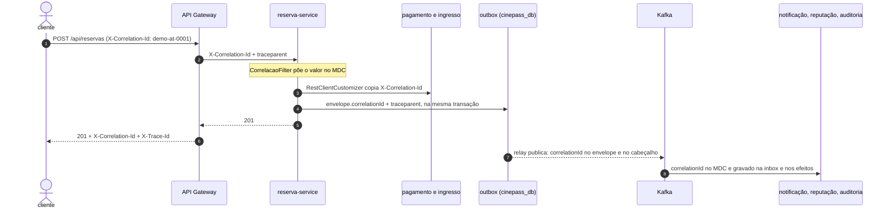
<!-- /apenas-github -->

| Trecho | Como o `correlationId` viaja |
|---|---|
| Cliente → Gateway | cabeçalho `X-Correlation-Id`, opcional; se ausente ou inválido, o Gateway gera um UUID |
| Gateway → reserva-service | o Gateway grava o cabeçalho na requisição repassada e devolve `X-Correlation-Id` e `X-Trace-Id` na resposta |
| dentro do reserva-service | `CorrelacaoFilter` põe o valor no MDC durante toda a requisição |
| reserva → pagamento e ingresso | um `RestClientCustomizer` copia o valor do MDC para o cabeçalho de saída |
| reserva → Kafka | campo `correlationId` do envelope, gravado no outbox, e cabeçalho Kafka de mesmo nome |
| Kafka → consumidores | o consumidor lê o envelope e põe o valor no MDC durante o processamento |
| consumidores → banco | gravado na inbox, nas notificações, no histórico e na auditoria |

Na execução real, o `X-Correlation-Id: demo-at-0001` enviado ao Gateway (Evidência 3) aparece no
outbox (Evidência 4), nos cabeçalhos do Kafka (Evidência 7), nas tabelas dos três consumidores (Evidência
9) e nas 48 linhas de log do Kibana (Evidência 13).

<p align="right"><a href="#-sum%C3%A1rio">⬆️ Sumário</a></p>

---

## 10. 🚨 Tratamento de falhas

> 📋 **Enunciado:** Falhas ocorridas durante o consumo de mensagens deverão ser registradas
> adequadamente. Uma falha de processamento não deverá comprometer mensagens não relacionadas. A
> solução deverá prever uma estratégia para mensagens que não possam ser processadas após as
> tentativas previstas pela aplicação. As mensagens com erro deverão permanecer disponíveis para
> diagnóstico e eventual reprocessamento.

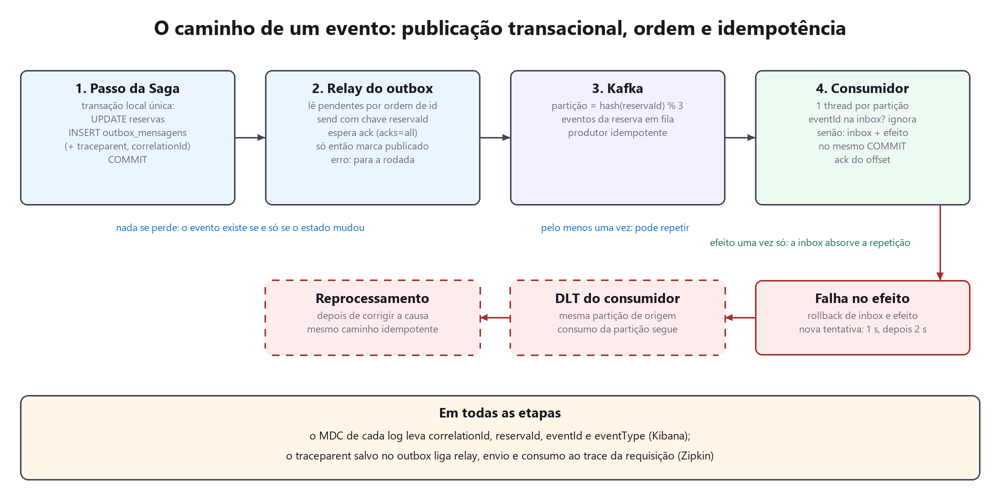

### Retentativa e DLT

Uma falha no efeito desfaz inbox e efeito juntos, e a mensagem é tentada de novo **no lugar**, com
espera crescente: 1 s e 2 s, três tentativas no total. Cada tentativa é registrada em log. Se as
três falharem, a mensagem vai para a **DLT do próprio consumidor**
(`cinepass.reserva.eventos.<consumidor>.DLT`), **na mesma partição de origem**, e o consumo da
partição continua. Uma mensagem ilegível vai direto, sem tentativas.

```java
var dlt = new DeadLetterPublishingRecoverer(kafka, (registro, erro) -> new TopicPartition(
        Topicos.dltDe(registro.topic(), consumidor),   // a DLT deste consumidor
        registro.partition()));                         // na mesma partição de origem
var espera = new ExponentialBackOffWithMaxRetries(tentativas - 1);
espera.setInitialInterval(esperaInicial);
espera.setMultiplier(2.0);
var tratamento = new DefaultErrorHandler(recuperador, espera);
tratamento.addNotRetryableExceptions(EnvelopeInvalidoException.class);
```

> [!IMPORTANT]
> **Por que retentativa bloqueante, e não tópicos de retry.** A alternativa não bloqueante libera a
> partição durante a espera, mas deixa o evento seguinte da mesma reserva passar à frente do que
> está esperando. Ordem por reserva é requisito (item 4). O custo é que outras reservas da mesma
> partição esperam alguns segundos; nenhuma fica presa, porque depois das tentativas a mensagem sai
> da frente.

> [!NOTE]
> **Por que uma DLT por consumidor.** A mesma mensagem pode falhar só na notificação e passar na
> auditoria. Com uma DLT compartilhada, o reprocessamento a reentregaria a quem já a processou.

### Diagnóstico e reprocessamento

As mensagens ficam na DLT com o envelope intacto e os cabeçalhos de diagnóstico do Spring Kafka
(tópico, partição e offset de origem, classe e mensagem da exceção), visíveis no Kafka UI (Evidência
17). Depois de corrigida a causa, `POST /api/<serviço>/dlt/reprocessar` lê a DLT em ordem, pelo
mesmo caminho idempotente, num grupo de consumo próprio: o que foi reprocessado não volta, e o que
falhar de novo para ali, sem ultrapassar o evento seguinte da mesma reserva.

O cenário demonstrado: um cliente sem contato cadastrado faz uma reserva. A reserva é confirmada,
a auditoria e a reputação processam normalmente, e só a notificação falha, três vezes, e manda os
três eventos para a sua DLT (Evidência 16). A mensagem de outra reserva, publicada depois na mesma
partição, segue normalmente, o que o teste `falhaPersistenteVaiParaADltEPodeSerReprocessadaDepoisDaCorrecao`
confere. Cadastrado o contato, o reprocessamento lê 3, reprocessa 3 e as notificações aparecem
(Evidência 18).

### Falhas no lado do produtor

- **Relay.** Se o Kafka estiver fora, o relay registra o erro na própria linha (`tentativas`,
  `ultimo_erro`), para a rodada e tenta de novo meio segundo depois. Nada se perde, porque a linha
  só é marcada depois do ack.
- **Saga.** Falha no ingresso depois de pagamento aprovado dispara a compensação: estorno do
  pagamento e cancelamento da reserva, com os assentos devolvidos à sessão (Evidência 15). Na execução
  real apareceu uma falha que os testes não cobriam: logo após um restart, o load balancer ainda
  sem registro do Eureka lança `IllegalStateException` ("No instances available"), que não era
  tratada como falha de integração. A Saga não compensava, e a reserva ficava presa aguardando
  pagamento. Os adaptadores HTTP passaram a tratá-la, e a descoberta foi acelerada para 5
  segundos em desenvolvimento.

<p align="right"><a href="#-sum%C3%A1rio">⬆️ Sumário</a></p>

---

## 11. 🐳 Infraestrutura

> 📋 **Enunciado:** A infraestrutura disponibilizada no projeto deverá continuar sendo utilizada:
> Eureka Server; API Gateway; Apache Kafka em modo KRaft; PostgreSQL; bancos separados por
> microsserviço. Os componentes adicionais necessários para observabilidade poderão ser adicionados
> ao ambiente Docker Compose. A inicialização do ambiente deverá permanecer documentada no projeto.

| Componente | Imagem | Porta | Observação |
|---|---|:---:|---|
| PostgreSQL | `postgres:18-alpine` | 5432 | seis bancos, criados por `infra/postgres/init.sql` |
| Kafka | `apache/kafka:4.3.1` | 9092 | **KRaft**, sem ZooKeeper (a base usava ZooKeeper); ouvinte interno `kafka:29092` |
| Kafka UI | `kafbat/kafka-ui:v1.5.0` | 8090 | o fork mantido do antigo provectuslabs |
| Elasticsearch | `elasticsearch:9.5.3` | 9200 | nó único, segurança desligada no ambiente de desenvolvimento |
| Logstash | `logstash:9.5.3` | 5000 | pipeline em `infra/logstash/pipeline/` |
| Kibana | `kibana:9.5.3` | 5601 | data view criada por `infra/kibana/configurar.sh` |
| Zipkin | `openzipkin/zipkin:3` | 9411 | |
| Eureka, Gateway e seis serviços | construídos pelo `Dockerfile` | 8761, 8080 a 8086 | uma imagem por serviço, sem root |

> [!NOTE]
> Os bancos são separados por serviço: `cinepass_db` (reserva, nome mantido da base),
> `pagamento_db`, `ingresso_db`, `notificacao_db`, `reputacao_db` e `auditoria_db`. Nenhum serviço
> conhece a credencial ou o esquema do banco de outro.

Um único `Dockerfile` serve aos oito serviços, com o módulo passado por argumento. O build
acontece dentro do Docker, com o cache do Maven compartilhado entre as imagens, e a imagem final
roda em JRE 25 Alpine, com usuário sem privilégio. A inicialização:

```bash
docker compose up -d --build        # tudo
docker compose ps                   # estado
docker compose down -v              # derruba e apaga bancos, tópicos e índices
```

As instruções completas, inclusive para subir só a infraestrutura e rodar os serviços pela IDE,
estão no `README.md`. A Evidência 1 mostra os quinze containers de pé e a Evidência 2, os sete serviços
registrados no Eureka.

<p align="right"><a href="#-sum%C3%A1rio">⬆️ Sumário</a></p>

---

## 12. 📘 Documentação da solução

> 📋 **Enunciado:** A entrega deverá conter documentação suficiente para executar e compreender a
> solução, incluindo: visão geral da arquitetura; serviços participantes; tópicos Kafka utilizados;
> eventos existentes; formato das mensagens; estratégia de particionamento; estratégia de
> idempotência; mecanismo utilizado para publicação transacional; solução adotada para
> centralização de logs; configuração utilizada para tracing; instruções para inicialização da
> infraestrutura; exemplos de chamadas para geração de eventos.

| Exigência | Onde está |
|---|---|
| visão geral da arquitetura | README (Arquitetura), Nota de escopo deste relatório, Diagramas 1 e 2 |
| serviços participantes | README (Serviços e estrutura), item 2 |
| tópicos Kafka | `docs/EVENTOS.md` §2, item 1 |
| eventos existentes | `docs/EVENTOS.md` §5, `docs/asyncapi.yaml` |
| formato das mensagens | `docs/EVENTOS.md` §4, item 3 |
| estratégia de particionamento | `docs/EVENTOS.md` §3, item 4 |
| estratégia de idempotência | item 5, `docs/EVENTOS.md` §6 |
| publicação transacional | item 5 (por que há duplicata), seção abaixo, Javadoc de `PublicadorOutbox` e `RelayOutbox` |
| centralização de logs | item 7, README (Observabilidade) |
| configuração de tracing | item 8 |
| inicialização da infraestrutura | item 11, README (Como rodar), cabeçalho do `docker-compose.yml` |
| exemplos de chamadas | `requests/cinepass.http`, coleção `bruno/`, README |

### Publicação transacional: Transactional Outbox

O problema é a gravação dupla: gravar a reserva no PostgreSQL e publicar no Kafka são duas
operações em sistemas diferentes, sem transação comum. Publicar antes do commit pode anunciar uma
mudança que sofreu rollback; publicar depois pode perder o evento se o processo cair entre os dois.
Transação distribuída (XA) entre banco e Kafka não é suportada de forma prática.

A solução é o **Transactional Outbox**: o evento vira uma linha na tabela `outbox_mensagens`, na
**mesma transação** que muda a reserva. Ou os dois são gravados, ou nenhum. O método que grava é
`Propagation.MANDATORY`: chamá-lo fora de transação é erro de programação e falha alto.

```java
@Transactional(propagation = Propagation.MANDATORY)
public void publicar(String topico, EventoEnvelope envelope) {
    String payload = jsonMapper.writeValueAsString(envelope);
    String cabecalhos = jsonMapper.writeValueAsString(rastreamento.capturar());
    repositorio.save(new OutboxMensagem(envelope.eventId(), envelope.eventType(), topico,
            envelope.chave(), envelope.reservaId(), envelope.correlationId(),
            payload, cabecalhos, Instant.now()));
}
```

> [!IMPORTANT]
> O **relay** lê as linhas pendentes em ordem, publica, espera o ack do broker e só então marca a
> linha. A ordem desses três passos é o padrão inteiro: marcar antes de confirmar reintroduziria a
> perda.

A garantia resultante é *pelo menos uma vez*, e o efeito único vem da inbox dos
consumidores (item 5): uma tabela em cada ponta, e no meio a garantia real. O teste
`OutboxTransacionalTest` confere os dois lados: rollback do passo leva a linha junto; commit
termina publicado e marcado.

<p align="right"><a href="#-sum%C3%A1rio">⬆️ Sumário</a></p>

---

## 13. 📸 Evidências da execução

> 📋 **Enunciado:** A entrega deverá permitir verificar o funcionamento dos fluxos implementados.
> Deverão ser apresentadas evidências que demonstrem: requisição recebida pelo API Gateway;
> alteração persistida no contrato-service; evento publicado no Kafka; consumo do evento pelos
> serviços interessados; persistência realizada pelos consumidores; tratamento de uma mensagem
> duplicada; manutenção da ordem dos eventos de um mesmo contrato; logs da mesma operação
> consultados de forma centralizada; trace correspondente disponível no Zipkin.

> [!NOTE]
> Todas as figuras vêm de uma única execução, com o ambiente zerado (`docker compose down -v` e
> `up`). Os comandos de terminal foram executados no PowerShell do aluno; as páginas, nos painéis
> do próprio ambiente. A operação de demonstração usa `X-Correlation-Id: demo-at-0001` e gerou a
> reserva `e7ea6298-e21c-42c7-bedf-85acefa72808` e o trace `6ac027ede36e21a69e167ab3ba283c8e`.

### 🖥️ Ambiente

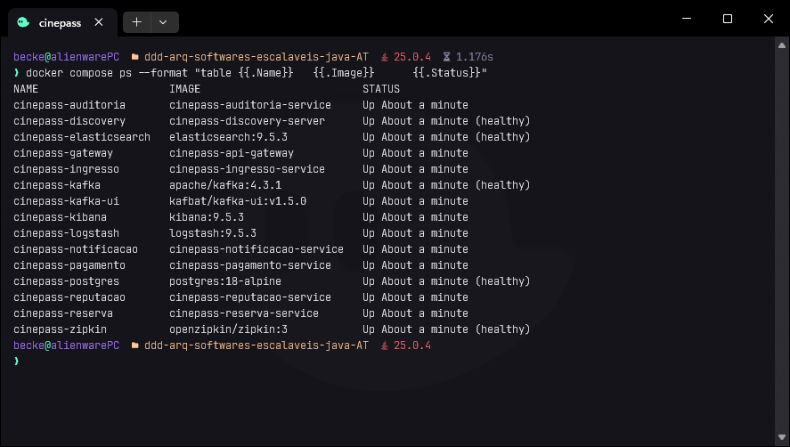

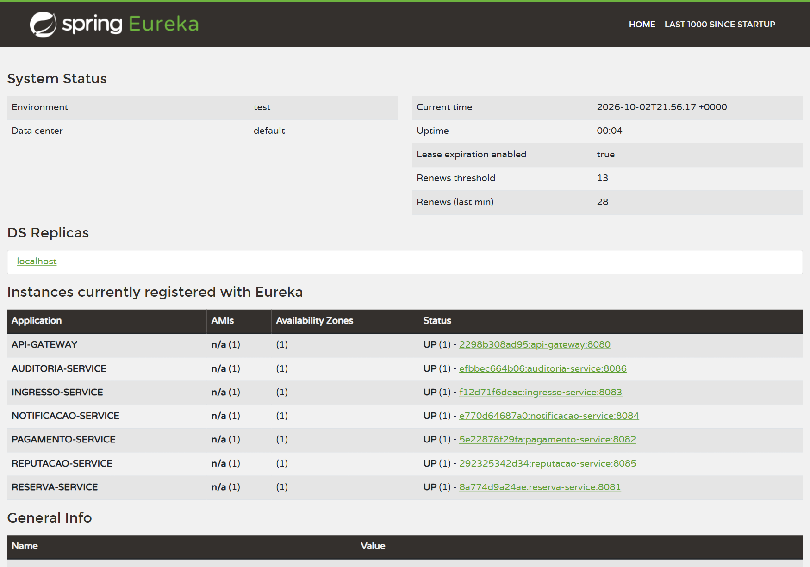

### 🚪 Requisição recebida pelo API Gateway

O cliente envia `X-Correlation-Id: demo-at-0001`. O Gateway devolve o mesmo identificador e o
`X-Trace-Id` do Zipkin; a Saga conclui com a reserva `CONFIRMADA`.

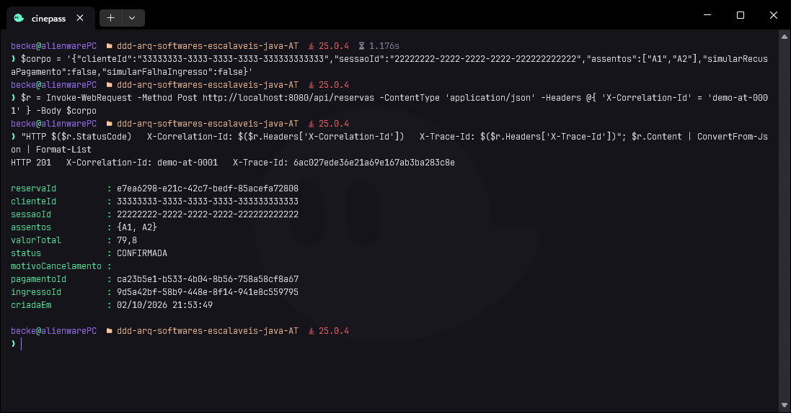

### 💾 Alteração persistida no reserva-service

A reserva está gravada no `cinepass_db` com `sequencia_eventos = 3`, e os três eventos estão na
tabela do outbox, na ordem, com o `correlationId` e a data de publicação.

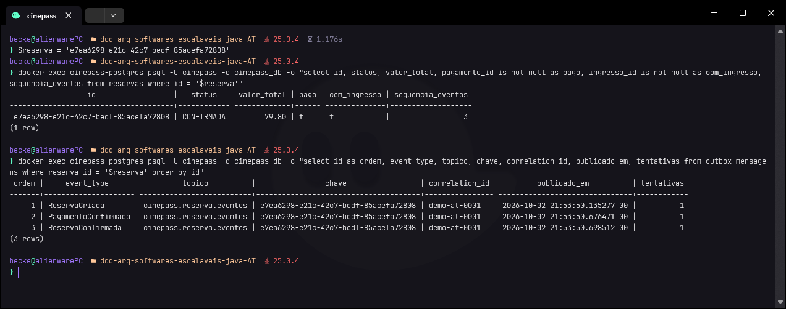

### 📤 Evento publicado no Kafka

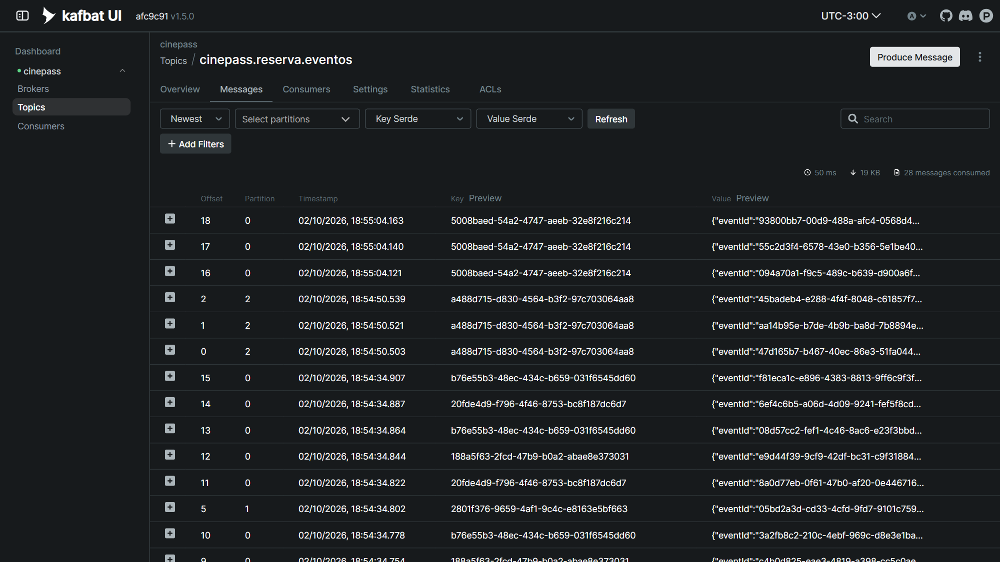

O envelope completo e os cabeçalhos. O offset 3 é a reentrega deliberada do item 5, com o mesmo
`eventId` do offset 2.

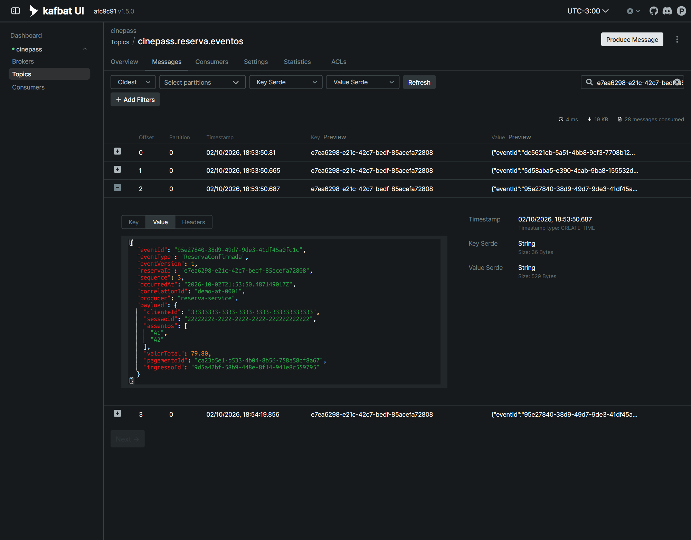

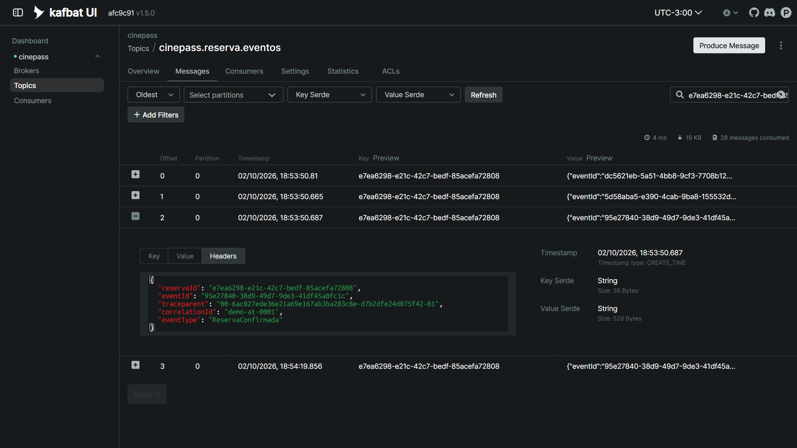

### 📥 Consumo pelos serviços interessados

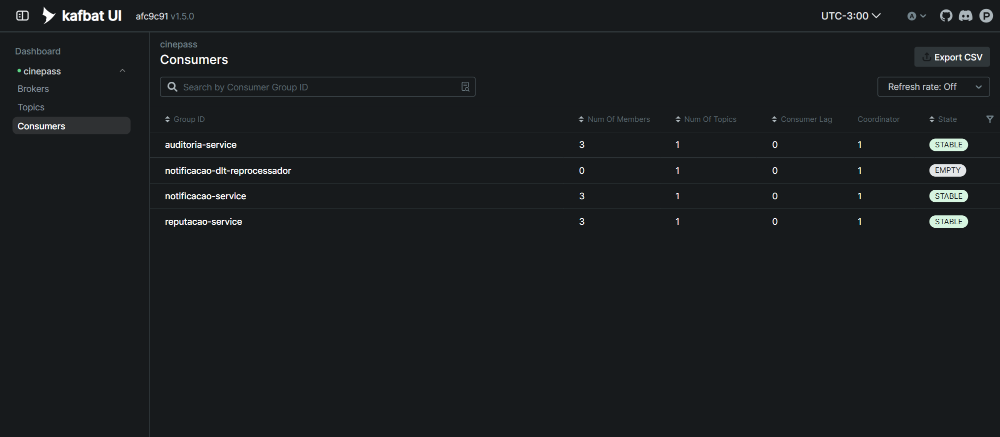

### 🗄️ Persistência realizada pelos consumidores

Três notificações com destinatário mascarado, a reputação do cliente com 79 pontos e a trilha de
auditoria com sequência, partição, offset, correlação e trace.

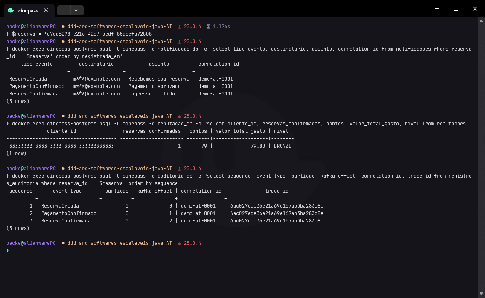

### 🔁 Tratamento de uma mensagem duplicada

O `ReservaConfirmada` já processado é devolvido ao outbox e publicado de novo com o mesmo
`eventId`. Os três consumidores o ignoram, e reputação (1 confirmada, 79 pontos) e notificações
(3) não mudam.

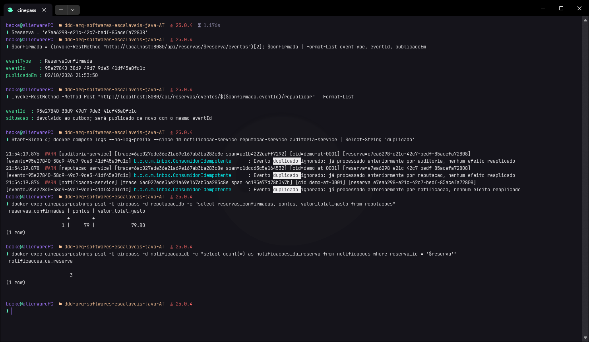

### 🔢 Manutenção da ordem dos eventos de uma mesma reserva

Seis reservas disparadas em paralelo. Para cada uma, os eventos foram consumidos em ordem de
offset, e a ordem é sempre `1 > 2 > 3`; reservas diferentes estão em partições diferentes.

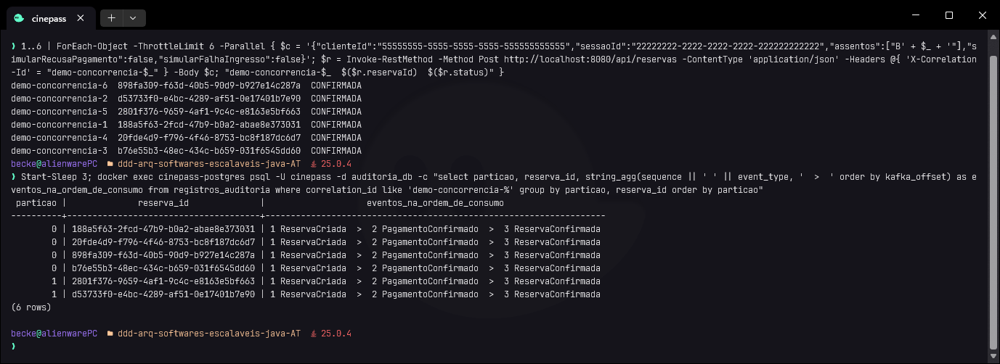

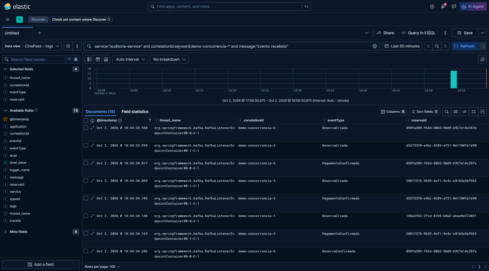

### 🔎 Logs da mesma operação consultados de forma centralizada


### 🛰️ Trace correspondente no Zipkin


### ♻️ Evidências complementares: compensação, falha e reprocessamento

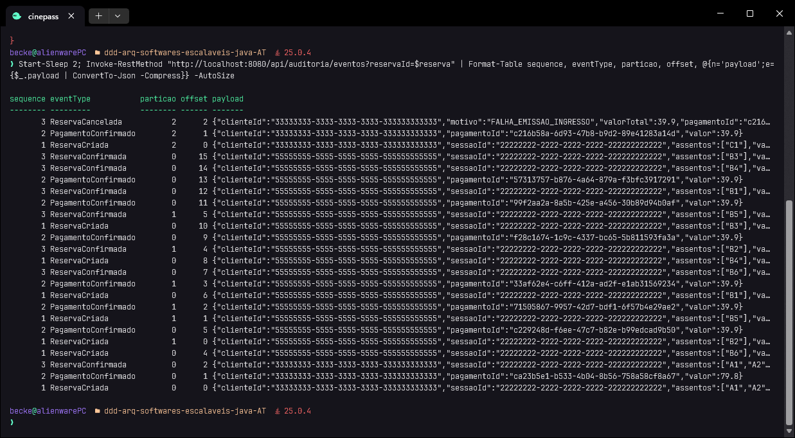

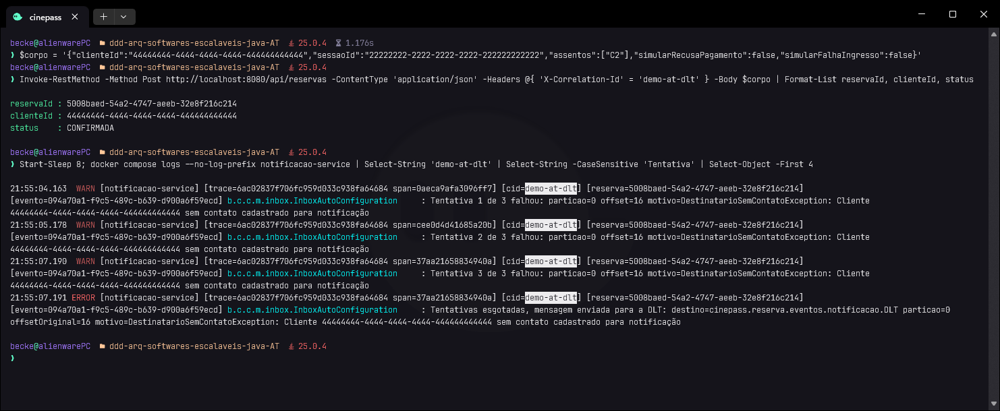

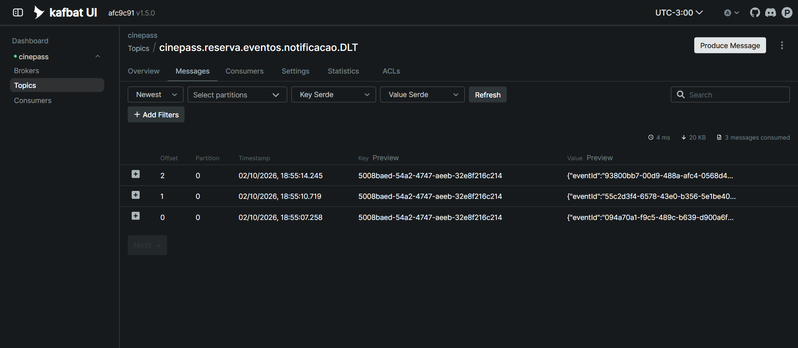

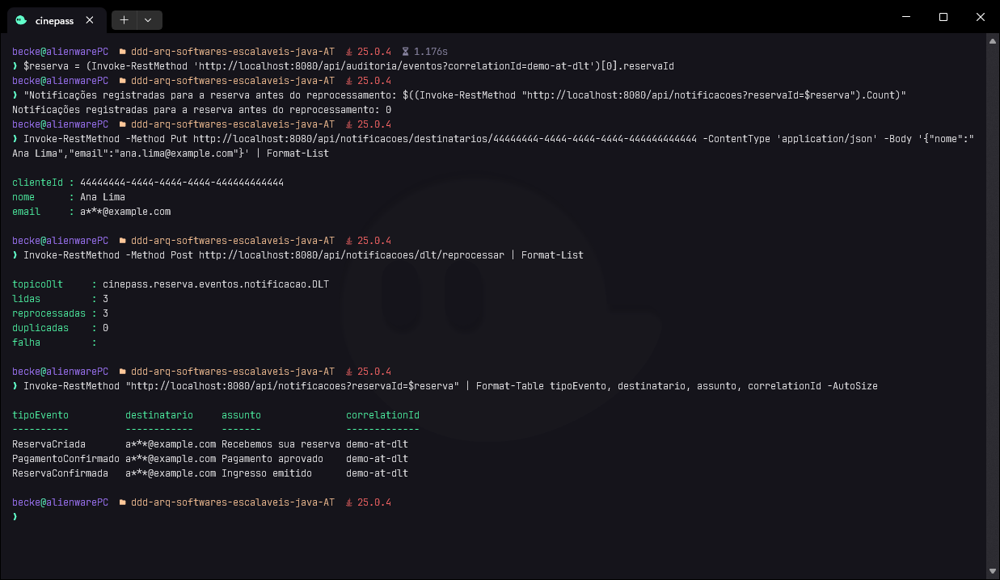

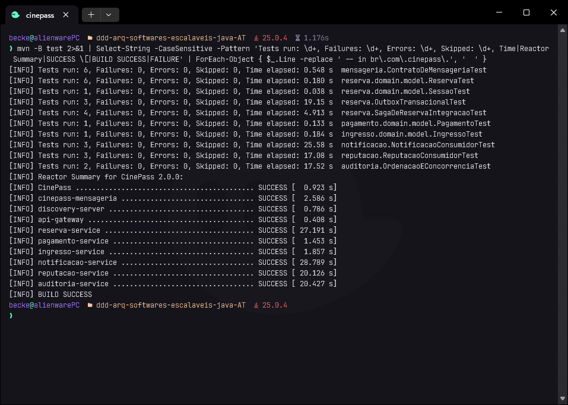

<p align="right"><a href="#-sum%C3%A1rio">⬆️ Sumário</a></p>

---

## 🧪 Testes automatizados

| Módulo | Testes | O que provam |
|---|:---:|---|
| cinepass-mensageria | 6 | envelope obrigatório e serializável, chave = reservaId, DLT por consumidor, validação do correlationId, MDC restaurado |
| reserva-service | 14 | eventos do agregado em sequência; Saga ponta a ponta com 3 eventos em ordem, mesma partição, correlationId e traceparent; compensação; recusa; outbox some no rollback e é publicado no commit; `MANDATORY`; concorrência na mesma sessão |
| pagamento-service | 1 | domínio (base do professor) |
| ingresso-service | 1 | domínio (base do professor) |
| notificacao-service | 3 | destinatário mascarado; duplicata não gera notificação; falha → DLT na mesma partição, mensagem não relacionada segue, reprocessamento depois da correção |
| reputacao-service | 3 | 3 entregas contam uma vez; 9 reservas do mesmo cliente em partições diferentes sem atualização perdida; penalidade só por recusa |
| auditoria-service | 2 | ordem 1..10 por reserva com 3 threads paralelas; consulta por correlationId e duplicata auditada uma vez |
| **Total** | **30** | |

> [!TIP]
> Dois mecanismos foram verificados também por mutação, desfazendo a solução e vendo o teste falhar
> pelo motivo certo: sem o bloqueio da sessão, as reservas simultâneas falham por conflito de versão;
> sem o `insert ... on conflict` e o bloqueio da reputação, 9 confirmações viram 7.

<p align="right"><a href="#-sum%C3%A1rio">⬆️ Sumário</a></p>

---

## 🚧 Limites desta entrega

- **Uma instância do relay.** Com várias instâncias do `reserva-service`, duas leriam as mesmas
  linhas do outbox. A duplicata seria absorvida pelos consumidores, mas a ordem entre instâncias
  exigiria `select ... for update skip locked` com partição das linhas por reserva, ou eleição de
  líder.
- **CDC não usado.** Debezium lendo o WAL do PostgreSQL eliminaria o polling do relay. Para o
  volume deste trabalho, o polling de meio segundo é suficiente e muito mais simples de operar.
- **Saga sem retomada automática.** O estado da Saga é persistido (o status da reserva), mas não
  há um vigia que retome ou compense uma reserva que ficou parada por queda do processo no meio de
  um passo. O Temporal da base resolvia isso; aqui fica como evolução declarada.
- **Envio de notificação simulado.** O efeito é registrar a notificação. Um envio real (SMTP, push)
  seria um efeito externo, que precisaria de um outbox próprio no notificacao-service.
- **Segurança do ambiente.** Elasticsearch sem TLS e sem usuário, Kafka em PLAINTEXT, nenhuma
  autenticação na API. É ambiente de desenvolvimento; nenhum critério da rúbrica trata de
  autenticação.
- **Replicação.** Um broker Kafka e um nó Elasticsearch. Em produção, fator de replicação 3 e
  `min.insync.replicas` 2.

<p align="right"><a href="#-sum%C3%A1rio">⬆️ Sumário</a></p>

---

## 📖 Referências

- RICHARDSON, Chris. **Microservices Patterns: with examples in Java**. Shelter Island: Manning, 2018. Capítulos 3 (comunicação por mensagens, *Transactional Outbox*, consumidor idempotente) e 4 (Sagas).
- RICHARDSON, Chris. **Pattern: Transactional outbox**. microservices.io. Disponível em: <https://microservices.io/patterns/data/transactional-outbox.html>. Acesso em: 2 out. 2026.
- APACHE SOFTWARE FOUNDATION. **Apache Kafka Documentation 4.3**: design, idempotent producer, consumer groups. Disponível em: <https://kafka.apache.org/documentation/>. Acesso em: 2 out. 2026.
- SPRING. **Spring for Apache Kafka: Reference**. Handling Exceptions, Dead-letter Publishing, Observation. Disponível em: <https://docs.spring.io/spring-kafka/reference/>. Acesso em: 2 out. 2026.
- SPRING. **Spring Boot Reference: Observability e Tracing**. Disponível em: <https://docs.spring.io/spring-boot/reference/actuator/tracing.html>. Acesso em: 2 out. 2026.
- MICROMETER. **Micrometer Tracing Documentation**. Disponível em: <https://docs.micrometer.io/tracing/reference/>. Acesso em: 2 out. 2026.
- OPENZIPKIN. **Zipkin**. Disponível em: <https://zipkin.io/>. Acesso em: 2 out. 2026.
- W3C. **Trace Context**. W3C Recommendation. Disponível em: <https://www.w3.org/TR/trace-context/>. Acesso em: 2 out. 2026.
- ELASTIC. **Elastic Stack Documentation 9.x**: Logstash TCP input, Kibana Discover. Disponível em: <https://www.elastic.co/docs>. Acesso em: 2 out. 2026.
- LOGFELLOW. **logstash-logback-encoder**. Disponível em: <https://github.com/logfellow/logstash-logback-encoder>. Acesso em: 2 out. 2026.
- ASYNCAPI INITIATIVE. **AsyncAPI Specification 3.1.0**. Disponível em: <https://www.asyncapi.com/docs/reference/specification/v3.1.0>. Acesso em: 2 out. 2026.
- EVANS, Eric. **Domain-Driven Design: atacando as complexidades no coração do software**. 3. ed. Rio de Janeiro: Alta Books, 2016.
- GLORIA, Leonardo Silva da. **cinepass**: base para ensino de Saga Pattern. GitHub, 2026. Disponível em: <https://github.com/leoinfnet/cinepass>. Acesso em: 2 out. 2026.

<!-- apenas-github -->
---

<div align="center">

[⬆️ Sumário](#-sum%C3%A1rio) · [⬅️ README](../README.md) · [📨 Eventos](EVENTOS.md) · [📸 Evidências](evidencias)

<sub>Infnet · Bloco Engenharia de Softwares Escaláveis · DR4 · 26E3 · André Luis Becker</sub>


</div>

<!-- /apenas-github -->
